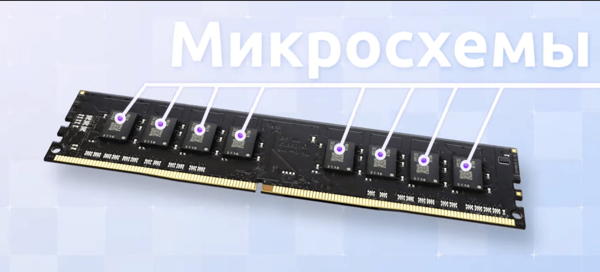

<https://www.youtube.com/watch?v=k9wK2FThEsk> 23:38 Про память

## Классификация памяти:

-  ПЗУ (ROM) - **постоянное** запоминающее устройство (*read-only memory -* память только для чтения)

-  ОЗУ (RAM) - **оперативное** запоминающее устройство (*random access memory* - память с произвольным доступом)

**ПЗУ** - это флеш-память, диски, HDD, SSD, микросхема BIOS и так далее.

**ОЗУ** - это оперативная память, кэш всех уровней, регистры.

## Различия ПЗУ и ОЗУ

Различия кроются в названии.

К ПЗУ у процессора доступа к записи нет, **только к чтению**. Запись на ПЗУ производится средствами ОС.

ОЗУ у процессора есть возможность **и читать, и писать**.

Также **ПЗУ является энергонезависимой памятью,** то есть сохраняет данные даже при выключении питания.

А вот **ОЗУ является энергозависимой памятью**, то есть данные в ОЗУ теряются при отключении питания.

**ОЗУ подразделяется на 2 основных типа**: DRAM (Dynamic Random Access Memory) и SRAM (Static Random Access Memory). Они имеют разные архитектуры, способы работы, характеристики и применения

## Какой же DRAM и SRAM (типы ОЗУ)

### DRAM (Dynamic Random Access Memory)

1. **Архитектура**:

   -  DRAM использует конденсаторы для хранения каждого бита данных. Конденсатор либо заряжен (представляет 1), либо разряжен (представляет 0).

   -  Конденсаторы теряют заряд со временем, поэтому DRAM требует регулярного обновления (refresh), чтобы сохранить данные.

2. **Скорость**:

   DRAM медленнее по сравнению с SRAM, из-за необходимости обновления данных и использования конденсаторов.

3. **Плотность хранения**:

   DRAM имеет более высокую плотность хранения, что позволяет разместить больше памяти на меньшей площади. Это делает DRAM более экономичной по стоимости на бит по сравнению с SRAM.

4. **Энергопотребление**:

   DRAM потребляет больше энергии из-за постоянного обновления данных.

5. **Применение**:

   DRAM широко используется в системной памяти (оперативной памяти).

6. **Примеры типов DRAM**:

   DDR (Double Data Rate), DDR2, DDR3, DDR4, DDR5 -- улучшенные версии DRAM, обеспечивающие большую скорость передачи данных.

### SRAM (Static Random Access Memory)

1. **Архитектура**:

   -  SRAM использует шесть транзисторов для хранения каждого бита данных. Данные хранятся в виде состояния триггера, что обеспечивает их сохранность без необходимости обновления.

   -  Триггер (flip-flop) сохраняет свои данные до тех пор, пока питание включено.

2. **Скорость**:

   SRAM быстрее по сравнению с DRAM, так как она не требует обновления и использует более простую архитектуру транзисторов.

3. **Плотность хранения**:

   SRAM имеет более низкую плотность хранения, так как требуется больше компонентов для хранения каждого бита данных. Это делает SRAM более дорогой по стоимости на бит по сравнению с DRAM.

4. **Энергопотребление**:

   SRAM потребляет меньше энергии при сохранении данных, но больше энергии при доступе к ним, по сравнению с DRAM. В целом, она более энергоэффективна для применения, где требуется высокая скорость.

5. **Применение**:

   SRAM используется в качестве реестров процессора, кэш-памяти процессоров (L1, L2, L3, L4 кэши), а также в ряде других устройств (кэш в GPU, буфер в HDD и SSD и так далее).

## Устройство ОЗУ

Подробнее мы будем говорить уже про ОЗУ, так как меня, как программиста на Go, мало волнует строение регистров и кэша.

ОЗУ из себя представляет плату с микросхемами.  

