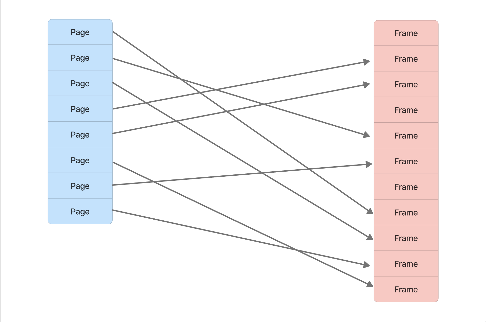
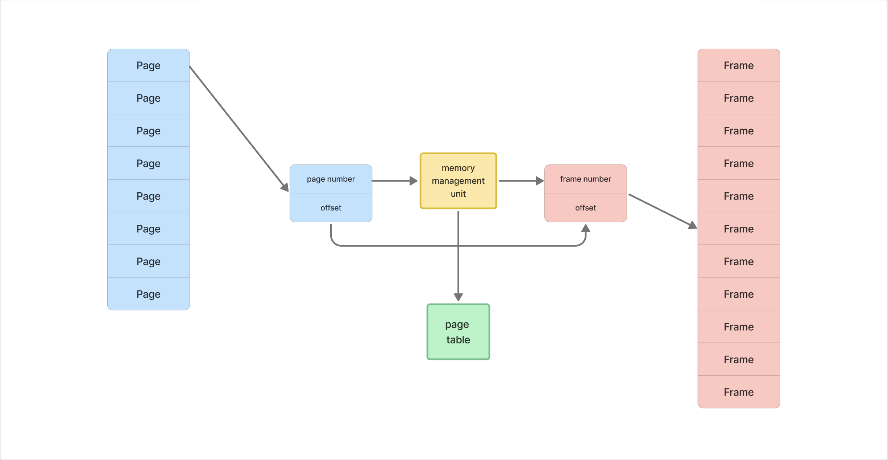

## Прелюдия

Если ты не потрогал сам лично  Linux, крайне рекомендую получить такой незабываемый опыт осознания разницы философий винды и линуха, хотя бы уже просто на уровне user experience, когда от стадии непринятия терминала ты доходишь до стадии презрения к виндовому powershell. Для этого просто посиди недельку другую на линухе как на основной системе.

Ну и как факт, знания линукса сейчас требуется во многих вакансиях, так как ты будешь разрабатывать с вероятностью 99% сервисы именно под линуксоидные серваки.

Именно поэтому в этой статье **я буду больше опираться на работу Linux.**

## Что такое ОС

ОС по сути является **прослойкой между железом и софтом**. Она выполняет множество критически важных функций, обеспечивая взаимодействие между программами и аппаратными ресурсами компьютера. Такой вот менеджер ресурсов

## Функции ОС

Давай так, функций операционок предостаточно, но их все перечислять сейчас особого смысла нет, по крайней мере для старта в Гошке. Иначе копать вглубь можно бесконечно долго, операционные системы - это целая наука. На этом я буду основывать на протяжении всей статьи. Слишком глубоко копать не буду.

Хочешь углубиться в тему – погружайся в гугл, но аккуратно выбирай источники, не стоит читать первую попавшуюся статью на Хабре. Сейчас модно поливать помоями Википедию, но я бы сперва пошёл туда.

Разберём те функции, которые для нас сейчас наиболее важны для общего понимания роли ОС.

### 1\. **Управление памятью и процессами**

-  **Загрузка программ и управление памятью**: ОС загружает программы в память, распределяет память между процессами, организует виртуальную память.

-  **Исполнение запросов программ**: Обработка ввода/вывода (input/output - i/o), запуск и остановка программ, управление памятью.

### 2\. **Распределение ресурсов, многозадачность и многопоточность**

-  **Распределение ресурсов**: Эффективное распределение процессорного времени и других ресурсов между процессами.

-  **Многозадачность**: Обеспечение параллельного выполнения задач путём переключения между процессами.

-  **Многопоточность**: Поддержка выполнения нескольких потоков внутри одного процесса, что позволяет выполнять несколько задач параллельно в рамках одного приложения.

### 3\. **Безопасность и взаимодействие**

-  **Защита системы и данных**: Обеспечение безопасности системы и данных от злонамеренных действий или ошибок.

-  **Взаимодействие между процессами**: Обмен данными и синхронизация между процессами.

### 4\. **Управление данными и устройствами**

-  **Файловая система**: Управление доступом к данным на дисках.

-  **Работа с устройствами**: Стандартизованный доступ к периферийным устройствам через унифицированные интерфейсы.

## Ядро

Ядро (kernel) является центральной частью операционной системы, управляющей аппаратным обеспечением и обеспечивающей взаимодействие между программным обеспечением и аппаратурой. В Linux, как и в других операционных системах, ядро выполняет множество критических функций, и его работа критична для функционирования всей системы. Давайте рассмотрим его подробнее.

### Определение и задачи ядра

Ядро -- это привилегированная часть операционной системы, которая работает в режиме ядра (kernel mode) и имеет полный доступ к аппаратным ресурсам компьютера и является постоянно загруженным в ОЗУ. Оно управляет аппаратным обеспечением и предоставляет интерфейсы для пользовательских приложений, работающих в пользовательском режиме (user mode).

#### Основные задачи ядра:

1. **Управление процессами**:

   -  **Создание и завершение процессов**: Ядро управляет созданием новых процессов с помощью системных вызовов, таких как `fork()`, и завершением процессов через вызовы типа `exit()`.

   -  **Планирование процессов (scheduling)**: Ядро распределяет процессорное время между процессами и потоками, используя алгоритмы планирования.

   -  **Переключение контекста (context switching)**: Ядро сохраняет состояние текущего процесса и загружает состояние следующего процесса, когда переключается между процессами.

2. **Управление памятью**:

   -  **Выделение и освобождение памяти**: Ядро отвечает за выделение памяти для процессов и освобождение её по мере необходимости.

   -  **Виртуальная память**: Ядро управляет виртуальной памятью, создавая абстракцию, которая позволяет каждому процессу видеть свою собственную память, даже если физическая память ограничена.

   -  **Страничная замена (paging) и сегментация**: Ядро управляет процессами страниц и сегментов памяти, чтобы оптимизировать использование физической памяти.

3. **Управление устройствами**:

   -  **Драйверы устройств**: Ядро содержит драйверы, которые взаимодействуют с аппаратными устройствами, такими как дисковые накопители, сетевые адаптеры и периферийные устройства.

   -  **Обработка прерываний (interrupts)**: Ядро обрабатывает аппаратные прерывания, чтобы реагировать на события, такие как ввод данных с клавиатуры или завершение операции ввода/вывода.

4. **Файловая система**:

   -  **Управление файловыми системами**: Ядро управляет файловыми системами, предоставляя интерфейсы для создания, удаления и модификации файлов и директорий.

   -  **Работа с файловыми дескрипторами**: Ядро управляет файловыми дескрипторами, которые используются процессами для доступа к файлам и устройствам.

5. **Сетевые операции**:

   -  **Сетевые протоколы и коммуникация**: Ядро управляет сетевыми протоколами и обеспечивает коммуникацию между процессами через сети.

   -  **Обработка сетевых пакетов**: Ядро обрабатывает входящие и исходящие сетевые пакеты, выполняя маршрутизацию и управление сетевыми соединениями.

### Архитектура ядра Linux

Ядро Linux имеет модульную архитектуру, что означает, что оно состоит из различных компонентов, которые могут быть загружены и выгружены по мере необходимости. Основные компоненты ядра Linux:

1. **Основное ядро (core kernel)**:

   -  **Процессорное управление**: Управляет процессами и потоками.

   -  **Управление памятью**: Отвечает за распределение и управление памятью.

   -  **Системные вызовы**: Предоставляет интерфейсы для взаимодействия с пользовательскими приложениями.

2. **Модули ядра (kernel modules)**:

   -  **Драйверы устройств**: Модули, которые обеспечивают поддержку различных аппаратных устройств.

   -  **Файловые системы**: Модули для поддержки различных файловых систем (например, ext4, XFS).

   -  **Сетевые протоколы**: Модули для поддержки различных сетевых протоколов.

3. **Системные вызовы (system calls)**:

   -  **Интерфейс для пользовательских приложений**: Предоставляет функции, которые приложения могут вызывать для выполнения операций, требующих привилегий ядра (например, доступ к файлам, создание процессов).

4. **Диспетчер прерываний (interrupt handler)**:

   -  **Обработка аппаратных прерываний**: Обрабатывает прерывания от аппаратного оборудования и запускает соответствующие обработчики.

5. **Менеджер процессов (process manager)**:

   -  **Управление процессами**: Отвечает за создание, завершение и планирование процессов.

### Взаимодействие с приложениями

Приложения взаимодействуют с ядром через системные вызовы. Системные вызовы позволяют приложениям выполнять операции, которые требуют доступа к ресурсам, защищенным ядром. Например:

-  **Чтение и запись файлов**: Приложение вызывает `read()` или `write()`, чтобы взаимодействовать с файловой системой.

-  **Создание и завершение процессов**: Приложение использует `fork()` для создания новых процессов и `exit()`для их завершения.

-  **Работа с сетью**: Приложение может вызывать `socket()` для создания сетевого соединения и `send()`/`recv()`для обмена данными по сети.

### Заключение

Ядро Linux играет ключевую роль в управлении аппаратным обеспечением и обеспечении взаимодействия между пользовательскими приложениями и системными ресурсами. Оно обеспечивает управление процессами, памятью, устройствами, файловыми системами и сетевыми операциями, а также предоставляет интерфейс для пользовательских приложений через системные вызовы. Ядро Linux обладает модульной архитектурой, что позволяет расширять и настраивать его функциональность по мере необходимости.

## Как работает программа в ОС?

:::tip:true Доп литература для психов: 

1. Роберт Лав - Ядро Linux, описание процесса разработки

2. Илюшкин Б.И. Операционные системы. Процессы и потоки - Учебное пособие

:::

### Процесс

**Программа** -- это довольно большой набор инструкций, который для эффективного выполнения может быть декомпозирован программистом.

**Процесс** представляет собой экземпляр выполняемой программы.

Программа выполняется в одном или нескольких процессах, а процессы могут содержать потоки, где каждый поток отвечает за выполнение отдельных задач. Причём программист сам  управляет разделением программы на процессы и потоки.

**Процесс** можно воспринимать своего рода контейнером, внутри которого есть все необходимые ресурсы для выполнения программы. Это включает в себя индивидуальное адресное пространство памяти, дескрипторы файлов, переменные окружения и другие ресурсы.

:::info:true Структура процесса

1. **Идентификатор процесса (PID)**:

   -  Уникальный номер, который идентифицирует процесс в системе. Каждый процесс имеет свой PID, присваиваемый ему при создании.

2. **Память процесса**:

   -  **Текстовый сегмент (Text Segment)**: Содержит исполняемый код программы.

   -  **Сегмент данных (Data Segment)**: Включает статические переменные и глобальные данные.

   -  **Сегмент BSS (Block Started by Symbol)**: Содержит неинициализированные глобальные и статические переменные.

   -  **Куча (Heap)**: Динамическая память, используемая для выделения памяти во время выполнения программы.

   -  **Виртуальная память**: Адресное пространство процесса, отображаемое на физическую память через таблицы страниц. Про неё ниже.

3. **Состояние процесса (Task State Segment, TSS)**:

   -  Содержит информацию о текущем состоянии процесса, включая регистры процессора, указатель инструкции, указатель стека и флаги состояния.

4. **Приоритет процесса**:

   -  **Приоритеты**: В Linux процессы имеют динамические и статические приоритеты. Статический приоритет определяет базовое время выполнения процесса, а динамический может изменяться во время выполнения процесса в зависимости от его поведения и использования ресурсов.

   -  **Nice-значение**: Значение, которое может быть установлено для регулирования приоритета процесса. Чем выше значение nice, тем ниже приоритет процесса, и наоборот.

5. **Таблица дескрипторов файлов**:

   -  Содержит ссылки на все открытые файлы, сокеты и устройства, которые использует процесс. Эта таблица позволяет процессу взаимодействовать с файловой системой и другими внешними ресурсами.

6. **Таблица страниц (Page Table)**:

   -  Маппинг между виртуальными и физическими адресами. В Linux каждая таблица страниц организована иерархически (например, с использованием четырёхуровневой страничной таблицы на x86_64).

7. **Контрольный блок процесса (Process Control Block, PCB)**:

   -  Структура данных, которая хранит всю информацию, необходимую для управления процессом. В Linux она представлена структурой `task_struct`.

8. **Таймеры и сигналы**:

   -  **Сигналы**: Механизм асинхронного уведомления процесса о различных событиях (например, завершение программы, сигнал от другого процесса). Сигналы могут быть отправлены процессу для выполнения определённых действий, таких как завершение или остановка.

   -  **Таймеры**: Процессы могут устанавливать таймеры для выполнения определённых действий через заданное время.

9. **Процессорное время (CPU time)**:

   -  **Время в режиме пользователя (User Time)**: Время, которое процесс провёл, выполняя пользовательский код.

   -  **Время в режиме ядра (Kernel Time)**: Время, которое процесс провёл, выполняя системные вызовы или код ядра.

10. **Родственные связи**:

    -  Процессы в Linux организованы в иерархию, где каждый процесс имеет родителя и, возможно, дочерние процессы. Эта информация сохраняется в `task_struct` и позволяет системе отслеживать группы процессов.

11. **Окружение (Environment)**:

    -  Включает переменные окружения, которые процесс использует для выполнения задач. Это может включать путь к исполняемым файлам, настройки локали и другие параметры.

12. **Политика планирования (Scheduling Policy)**:

    -  **Round-robin (RR)**, **First-Come, First-Served (FCFS)**, **Completely Fair Scheduler (CFS)** и другие алгоритмы, используемые для определения порядка выполнения процессов.

:::

**Дочерние процессы** - это процессы, созданные на основе другого процесса. Процесс создания нового процесса на основе другого называется **форкингом (forking),** работает через системные вызов `fork()`. Когда новый процесс создается, он наследует множество характеристик от своего родительского процесса, являясь по сути его точной копией за исключением **PID** + у дочернего процесса появляется **PPID** (Parent Process ID). Есть ещё некоторые различия, но сейчас нам это не так важно.

После `fork()`, потомок может заменить свое содержимое другим программным кодом, вызывая `exec()`.

Системный вызов `exec()` загружает в память новый исполняемый файл и начинает его выполнение, заменяя собой исходный процесс.

После `exec()` процесс **перестает быть копией родителя** и начинает выполнение новой программы, сохраняя прежний PID и большинство атрибутов процесса, **оставаясь доченим процессом**.

Когда потомок завершает свою работу, он не исчезает сразу. Его запись в таблице процессов сохраняется, чтобы родительский процесс мог узнать статус завершения потомка. Такой процесс называется **зомби-процессом**.

Родитель должен вызвать `wait()` или `waitpid()`, чтобы получить информацию о завершении потомка и освободить запись о нем в таблице процессов. **После этого зомби-процесс удаляется.**

Если родительский процесс **завершится раньше дочернего**, дочерний процесс становится **сиротой**. В этом случае система переназначает дочерний процесс на процесс `init` (или `systemd`), который берет на себя ответственность за «усыновление» и управление завершением этого процесса.

После этого **сирота продолжает свою работу** без какой-либо зависимости от своего исходного родителя.

Процесс-сирота продолжает своё исполнение в обычном режиме, как и любой другой процесс, пока не завершит свои задачи или не будет явно остановлен.

Каждый процесс **изолирован от других процессов**, что позволяет защитить память и ресурсы одного процесса от вмешательства со стороны другого. При этом есть механизмы “общения” между процессами.

**Процессы могут взаимодействовать** через механизмы межпроцессного взаимодействия, такие как shared memory, message queues, pipes, и sockets.

**Shared memory** -- наиболее быстрый способ взаимодействия, так как процессы могут разделять одну и ту же область памяти.

Процессы могут открывать **сетевые сокеты** для связи с другими процессами или серверами через сеть. Как и файловые дескрипторы, сетевые сокеты являются ресурсами, которыми управляет процесс.

Процессы могут использовать разные модели ввода-вывода (например, синхронный, асинхронный или неблокирующий I/O) для работы с сетевыми сокетами.

### Поток

**Поток** в контексте операционной системы -- это независимая последовательность выполнения инструкций внутри процесса. Потоки позволяют процессу выполнять несколько задач параллельно, используя одно и то же окружение.

В Linux потоки (threads) выглядят для системы как отдельные процессы, но с определенными особенностями, которые отличают их от классических дочерних процессов.

Поток -- это единица выполнения, которая получает время процессора для выполнения инструкций. Без хотя бы одного потока процесс просто не может выполнять какие-либо действия. То есть **процесс без потока не может существовать**. Именно потоки выполняют работу.

Внутри процесса есть минимум один (основной) поток. Основной поток создается автоматически при создании процесса, и именно он начинает выполнение программы.

Основной поток выполняет код процесса, и он может создавать дополнительные потоки (в многопоточных приложениях) для параллельного выполнения задач.

Процесс в целом завершается, когда завершает свою работу основной поток или все потоки процесса завершены (если основной поток завершил работу, а остальные потоки продолжают работать, процесс может продолжать существовать до завершения последнего потока).

:::info:true Структура потока в Linux:

1. **Идентификатор потока (Thread ID)**:

   -  Уникальный идентификатор потока в рамках процесса, например, PID (Process ID) для потока в ядре Linux.

2. **Регистры процессора**:

   -  **Указатель инструкции (Program Counter, PC)**: Указывает на текущую инструкцию, которая выполняется.

   -  **Регистры общего назначения**: Хранят промежуточные данные и результаты вычислений.

   -  **Указатель стека (Stack Pointer, SP)**: Указывает на вершину стека потока, необходим для управления стеком.

3. **Стек (Stack)**:

   -  Отдельный стек для каждого потока, где хранятся локальные переменные, параметры функций и адреса возврата. Стек потока независим от стека других потоков.

4. **Состояние потока**:

   -  Определяет текущее состояние потока: **RUNNING** (выполняется), **READY** (готов к выполнению), **WAITING** (ожидает события), **TERMINATED** (завершён).

5. **Приоритет потока**:

   -  Определяет, насколько важен поток относительно других потоков. Это может включать **статический приоритет** и **динамический приоритет**, изменяющийся в зависимости от поведения потока.

6. **Контекст потока**:

   -  Включает в себя регистры процессора и указатель стека, а также другую информацию, необходимую для возобновления выполнения потока после его приостановки.

7. **Ресурсы потока**:

   -  **Файловые дескрипторы**: Дескрипторы открытых файлов и других ресурсов, доступных потоку.

   -  **Синхронизация и примитивы**: Механизмы для управления доступом к общим ресурсам и синхронизации между потоками, такие как мьютексы, семафоры и условные переменные.

8. **Данные потока**:

   -  **Потоковые данные**: Локальные переменные и данные, которые используются конкретным потоком в процессе выполнения.

:::

Потоки внутри одного процесса делят общее адресное пространство памяти. Это означает, что они могут совместно использовать данные в куче и глобальные переменные, что делает межпоточное взаимодействие более эффективным, но требует осторожности для избежания состояния гонки и других проблем синхронизации.

Каждый поток имеет собственные стек и регистры, но разделяет кучу процесса с другими потоками.

Все потоки с одним PID будут видны как один процесс с множеством потоков, если просмотреть их с помощью команд, таких как `ps` или `top`.

:::tip:true Если упростить

**Процесс - это контейнер**, который хранит в себе общие ресурсы (например кучу) для потоков + является обобщающей и изолирующей оболочкой для потоков (со своей виртуальной памятью), таким образом ОС общается не с отдельно взятыми потоками, а с целым процессом. При этом процесс сам по себе не выполняет работу, для этого у него есть как минимум **основной поток**, создающийся при запуске процесса, который уже может порождать дочерние потоки для многопоточных операций.

**Именно основной поток является по сути истансом запущенной программы.** В потоках уже есть свои отдельные ресурсы для работы, которые они не делят с другими потокам (например стек и регистры), но также они могут использовать общие ресурсы своего процесса.

Процессы тоже могут порождать дочерние процессы, создавая свои полные копии с возможностью загрузки туда другого кода для своих нужд.

:::

**Одновременно процессором может исполняться не больше потоков ОС, чем доступных потоков процессора (логических ядер)!**

Но ведь у нас постоянно запущено в ОС огромное количество процессов, как тогда они все исоплняются на компьютере, да ещё и одновременно? Тут влетает с двух ног планировщик.

## Планировщик и многопоточность

**Планировщик ОС выбирает**, какие потоки будут исполняться в данный момент на процессоре, а какие будут ожидать своей очереди. Этот выбор происходит на основе различных алгоритмов планирования (про них на начальном этапе не вижу смысла рассказывать), при этом поток может не выполниться до конца и уступить своё место другому потоку.

Когда планировщик решает, что поток должен уступить место другому потоку, он сохраняет состояние текущего потока (контекст) и загружает контекст нового потока. **Это называется переключением контекста.**

Планировщик ОС обеспечивает иллюзию параллельного выполнения множества потоков, за счёт быстрого переключения между потоками.

Потоки могут использовать примитивы синхронизации, такие как мьютексы, семафоры и другие механизмы, чтобы координировать доступ к разделяемым ресурсам.

Мьютексы и семафоры являются частью системы управления процессами и потоками в ОС. В большинстве современных операционных систем, таких как Linux и Windows, эти механизмы реализованы на уровне ядра.

Про примитивы синхронизации потоков мы поговорим отдельно, так как потом это поможет чуть глубже понять многопоточность в Go.

### Семафор

**Семафо́р** –  примитив синхронизации работы процессов и потоков, в основе которого лежит счётчик.

Довольно забавное название, такая метафора на потоки и железную дорогу.

Семафор содержит целое число, которое называется счётчиком. Это число отражает количество доступных ресурсов или разрешений.

Планировщик использует очереди готовности, где находятся процессы и потоки, ожидающие своей очереди на выполнение.

`wait` (или `down` или `P`\-операция): Операция, которая **уменьшает** значение счётчика на единицу. Если значение счётчика положительное, поток или процесс получает доступ к ресурсу и продолжает работу. Если счётчик равен нулю, поток или процесс блокируется и ждёт, пока ресурс не станет доступным (счётчик увеличится)

`signal` (или `up` или `V`\-операция): Операция, которая **увеличивает** значение счётчика на единицу. Если какой-то поток или процесс был заблокирован на операции `wait`, он будет разблокирован и сможет продолжить работу.

:::info:true Пример использования семафора:

Представь себе систему с пулом из трех соединений к базе данных. Чтобы предотвратить использование большего количества соединений, чем доступно, можно использовать семафор с начальным значением 3. Каждый раз, когда поток хочет получить соединение, он выполняет операцию `wait`. Если все три соединения заняты, поток будет ждать. Когда поток освобождает соединение, он выполняет `signal`, увеличивая значение семафора, что позволяет другому потоку получить доступ к освободившемуся соединению.

:::

Не смотря на метафору с железной дорогой, я воспринимаю семафор как секьюрити, который следит, чтобы в помещении было ровно обозначенное количество людей одновременно и пропускает остальных только тогда, когда уходит другой и освобождается место. \**Ковидные флешбэки\*.*

### Мьютекс

**Мьютекс** (от англ. *mutex*, сокращение от *mutual exclusion* -- "взаимное исключение") -- это примитив синхронизации, используемый в многопоточных и многопроцессорных системах для предотвращения одновременного доступа нескольких потоков или процессов к общему ресурсу. Основная задача мьютекса -- обеспечить, чтобы только один поток или процесс мог выполнять критическую секцию кода в любой момент времени, тем самым предотвращая состояния гонки и некорректное поведение программы.

Мьютексы **не блокируют** **использование** какой-то конкретной **области памяти напрямую**. Вместо этого они **блокируют выполнение кода**, который работает с этой памятью или ресурсами. Когда поток захватывает мьютекс (с помощью `mu.Lock()`), он получает право на выполнение критической секции. Другие потоки, которые пытаются захватить этот же мьютекс, будут заблокированы и вынуждены ждать, пока мьютекс не будет освобождён (с помощью `mu.Unlock()`).

**Мьютекс предоставляет две основные операции:**

-  `Lock()`: Эта операция захватывает мьютекс. Если мьютекс уже захвачен другим потоком, текущий поток будет заблокирован до тех пор, пока мьютекс не освободится.

-  `Unlock()`: Эта операция освобождает мьютекс, позволяя другим заблокированным потокам попытаться захватить его.

## Виртуальная память

:::tip 

На эту тему есть замечательное видео <https://www.youtube.com/watch?v=x4FQ6ASzkso&t=353s>

:::

ОС должна **выделить и** **изолировать память для каждого процесса**, как в целях безопасности данных, так и для оптимизации выделения памяти для процессов. Для решения многих вопросов работы  памяти был придуман механизм **виртуальной памяти**. Как это работает?

### **Основная идея виртуальной памяти**

Программы обращаются к памяти через виртуальные адреса. Виртуальное адресное пространство -- это логическая модель памяти, которую программа видит как непрерывный и однородный блок. Хотя это совсем не так.

Процессы  не «видят» физическую память напрямую и не знают, где физически хранятся данные -- в ОЗУ или в файле подкачки.

Виртуальная память делится на блоки фиксированного размера, называемые **страницами**. Размер страницы обычно составляет 4 КБ, хотя возможны и другие размеры в зависимости от архитектуры процессора и конфигурации операционной системы (например, 2 МБ или 1 ГБ).

Физическая память также делится на блоки того же размера, называемые **фреймами** (frames). Каждая страница виртуальной памяти может быть загружена в любой фрейм физической памяти.

Фреймы выделяются для страниц по разным алгоритмам, но так или иначе, страницы идут последовательно друг за другом, то есть сначала страница под номером 1, затем страница под номером 2 и так далее, но вот страница 1 может соответствовать фрейму под номером 8 а страница 2 может соответствовать фрейму под номером 5.

То есть по факту у нас в ОЗУ беспорядочно хранятся куски данных разных процессов.

Для процесса, однако, всё выглядит как последовательное пространство, потому что он работает с виртуальной памятью, а не с физическими адресами.

### Зачем так перемешивать фреймы?

Непоследовательное распределение фреймов позволяет ОС эффективно использовать физическую память, избегая фрагментации и недоиспользования ресурсов.

ОС может динамически выделять и освобождать память для процессов, не привязываясь к строгой последовательности фреймов.

Когда процессу требуется память, он обращается к операционной системе с запросом на выделение необходимого объёма виртуальной памяти, в процессе заполнения страниц, им присваиваются фреймы, куда и идёт запись.

### Как сопоставляются страницы и фреймы?

Для управления соответствием между виртуальными адресами (страницами) и физическими адресами (фреймами) используется **таблица страниц (page table)**. Каждому процессу соответствует своя таблица страниц, которая содержит информацию о том, где находятся соответствующие страницы в физической памяти.

При обращении программы к виртуальному адресу процессор с помощью **MMU** **(Memory Management Unit)** переводит этот адрес в физический с использованием таблицы страниц.

При запросе определённых данных, например значения переменной, передаётся не только номер страницы, ведь страница – это тоже область памяти, нас же интересуют конкретные байты. Поэтому передаётся ещё **смещение (offset)**, на котором относительно начала этой области памяти находятся нужные нам данные.

После того как физический фрейм найден, MMU добавляет offset из виртуального адреса к началу физического фрейма, чтобы получить **точный физический адрес конкретных данных.**

### **Подкачка (paging)**

Когда оперативной памяти не хватает, операционная система начинает использовать **файл подкачки (swap)**, перенося туда редко используемые страницы памяти из ОЗУ. Файл подкачки располагается системой на постоянных носителях по типу SSD или HDD. Выгруженные в файл подкачки страницы возвращаются в оперативную память, когда это необходимо ИЛИ в процессе prefetching’а. Это позволяет запускать программы, которые требуют больше памяти, чем доступно физически.

То есть логическое адресное пространство программы может быть больше, чем физически есть памяти в ОЗУ, как раз таки за счёт того, что не вся память используется программой единовременно и некоторые блоки могут быть перемещены на вторичный накопитель в файл подачки.

Если процесс пытается получить доступ к странице, которая не загружена в физическую память (например, была выгружена на диск), возникает **page fault** (исключение отказа страницы), и ОС загружает страницу обратно в ОЗУ. Процесс, который запросил доступ к отсутствующей странице, **временно приостанавливается**. Как только страница загружена в ОЗУ из вторичного накопителя и таблица страниц обновлена, **процесс возобновляет свою работу с того места, на котором остановился**, теперь уже с доступом к необходимым данным. Такой процесс, когда подгружаются страницы из swap при прямой необходимости называется **demand paging (подкачка по запросу или ленивая подкачка).**

### Prefetching

**Prefetching** **(предварительная подкачка)** из swap -- это процесс, при котором операционная система загружает страницы памяти из файла подкачки  обратно в оперативную память до того, как они понадобятся процессу. Это позволяет уменьшить задержки и повысить производительность, так как страницы могут быть уже в памяти, когда процесс захочет их использовать.

В Linux prefetching  происходит автоматически, управляется ядром операционной системы и связан с механизмами управления виртуальной памятью.

#### Как ОС понимает, что надо заранее подгрузить страницы?

Для принятия решения о том, какие страницы стоит заранее подгрузить, система использует несколько ключевых подходов:

1. **Анализ доступа к страницам**:

   Linux использует алгоритмы управления памятью, которые анализируют последние обращения к страницам. Если страница недавно была выгружена в swap, но процесс снова начал активно её использовать, то система может сделать вывод, что есть высокая вероятность повторного использования этой страницы и заранее подгружает её обратно в оперативную память.

2. **Swap readahead**:

   Когда процесс обращается к странице, находящейся в swap, и эта страница подгружается в оперативную память, Linux может также подгружать соседние страницы, предполагая, что они также могут скоро понадобиться процессу. Это особенно полезно для процессов, которые работают с последовательными блоками данных. В Linux существует параметр **page-cluster**, который определяет количество соседних страниц, подгружаемых вместе с запрашиваемой страницей.

3. **Swappiness**:

   Параметр swappiness в Linux регулирует агрессивность использования swap. Значение swappiness влияет на то, как часто ОС будет выгружать страницы в swap и как быстро она будет подгружать их обратно. Чем выше значение swappiness, тем чаще ОС будет использовать swap и тем быстрее она будет пытаться загружать страницы из swap обратно в память. Однако стоит отметить, что swappiness не влияет напрямую на prefetching, но косвенно может изменять поведение системы при работе со swap.

4. **Предсказание на основе предыдущей активности**:

   Linux может также использовать исторические данные о поведении процесса для предсказания будущих обращений к страницам памяти. Например, если процесс циклически обращается к определённым страницам, ОС может предугадать эти обращения и заранее подгрузить страницы из swap. Этот механизм является частью общего подхода к управлению памятью.

5. **Оценка свободной памяти**:

   Если в системе достаточно свободной оперативной памяти, ОС может быть более агрессивной в подгрузке страниц из swap, чтобы минимизировать потенциальные задержки при обращении к ним. Это делается для повышения производительности за счёт использования неактивных ресурсов. В противоположном случае, при недостатке памяти, система может менее агрессивно подгружать страницы из swap, чтобы избежать вытеснения недавно загруженных данных.

