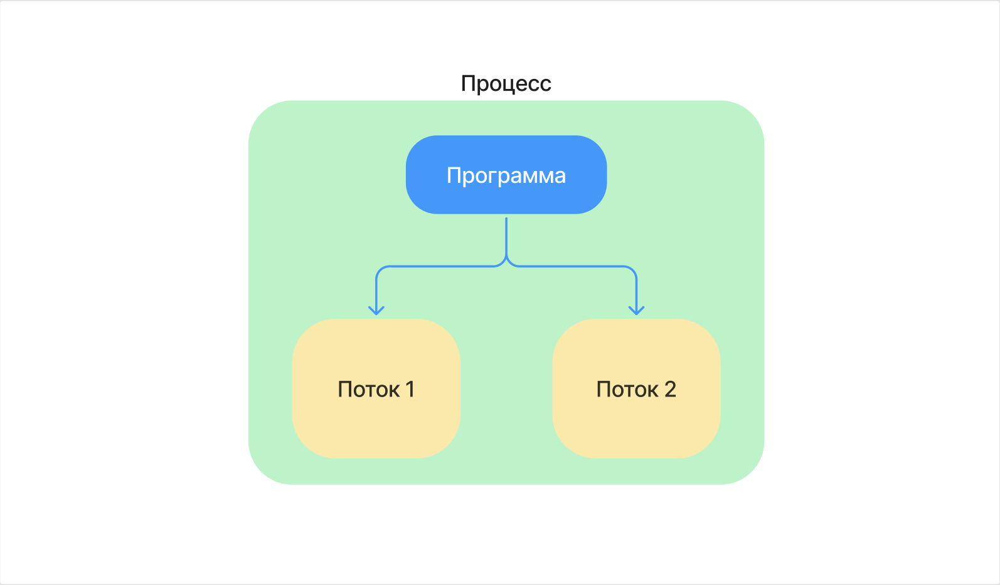

<https://www.youtube.com/watch?v=k9wK2FThEsk> 17:33 защищённый режим

<https://www.youtube.com/watch?v=k9wK2FThEsk> 31:26 про разделение программы на процессы и потоки

## Прелюдия

Думаю, про ОС особо много прелюдий не надо. Если ты не потрогал сам лично  Linux, крайне рекомендую получить такой незабываемый опыт осознания разницы философий винды и линуха, хотя бы уже просто на уровне user experience, когда от стадии непринятия терминала ты доходишь до стадии презрения к виндовому powershell. Для этого просто посиди недельку на линухе как на основной системе. Ну и как факт, знания линукса сейчас требуется во многих вакансиях, так как ты будешь разрабатывать с вероятностью 99% сервисы именно под линуксоидные серваки.

## Что такое ОС

ОС по сути является прослойкой между железом и софтом. Она выполняет множество критически важных функций, обеспечивая взаимодействие между программами и аппаратными ресурсами компьютера. Такой вот менеджер ресурсов

## Функции ОС

Давай так, функций операционок предостаточно, но их все перечислять сейчас особого смысла нет, по крайней мере для старта в Гошке. Иначе копать вглубь можно бесконечно долго, операционные системы - это целая наука.

Хочешь углубиться в тему – погружайся в гугл, но аккуратно выбирай источники, не стоит читать первую попавшуюся статью на Хабре. Сейчас модно поливать помоями Википедию, но я бы сперва пошёл туда.

Разберём те функции, которые для нас сейчас наиболее важны для общего понимания роли ОС.

### 1\. **Управление памятью и процессами**

-  **Загрузка программ и управление памятью**: ОС загружает программы в память, распределяет память между процессами, организует виртуальную память.

-  **Исполнение запросов программ**: Обработка ввода/вывода (input/output - i/o), запуск и остановка программ, управление памятью.

### 2\. **Распределение ресурсов, многозадачность и многопоточность**

-  **Распределение ресурсов**: Эффективное распределение процессорного времени и других ресурсов между процессами.

-  **Многозадачность**: Обеспечение параллельного выполнения задач путём переключения между процессами.

-  **Многопоточность**: Поддержка выполнения нескольких потоков внутри одного процесса, что позволяет выполнять несколько задач параллельно в рамках одного приложения.

### 3\. **Безопасность и взаимодействие**

-  **Защита системы и данных**: Обеспечение безопасности системы и данных от злонамеренных действий или ошибок.

-  **Взаимодействие между процессами**: Обмен данными и синхронизация между процессами.

### 4\. **Управление данными и устройствами**

-  **Файловая система**: Управление доступом к данным на дисках.

-  **Работа с устройствами**: Стандартизованный доступ к периферийным устройствам через унифицированные интерфейсы.

## Как работает программа в ОС?

**Программа** -- это довольно большой набор инструкций, который для эффективного выполнения может быть декомпозирован программистом. Для ОС это производится следующим образом: программа выполняется в одном или нескольких процессах, а процессы могут содержать потоки, где каждый поток отвечает за выполнение отдельных задач. Причём сам программист управляет разделением программы на процессы и потоки.

**Поток** в контексте операционной системы -- это независимая последовательность выполнения инструкций внутри процесса. Он разделяет ресурсы (такие как память, дескрипторы файлов и т.д.) с другими потоками того же процесса. Потоки позволяют процессу выполнять несколько задач параллельно, используя одно и то же окружение.

Таким образом, процессы позволяют изолировать выполнение программы, а потоки внутри процессов обеспечивают параллелизм выполнения задач.

**Процесс** можно воспринимать своего рода контейнером, внутри которого есть все необходимые ресурсы для выполнения программы. Это включает в себя адресное пространство (память), дескрипторы файлов, переменные окружения и другие ресурсы.

Каждый процесс изолирован от других процессов, что позволяет защитить память и ресурсы одного процесса от вмешательства со стороны другого.

Потоки существуют внутри процесса и используют ресурсы процесса. Они выполняют инструкции программы, но разделяют память с другими потоками в том же процессе.