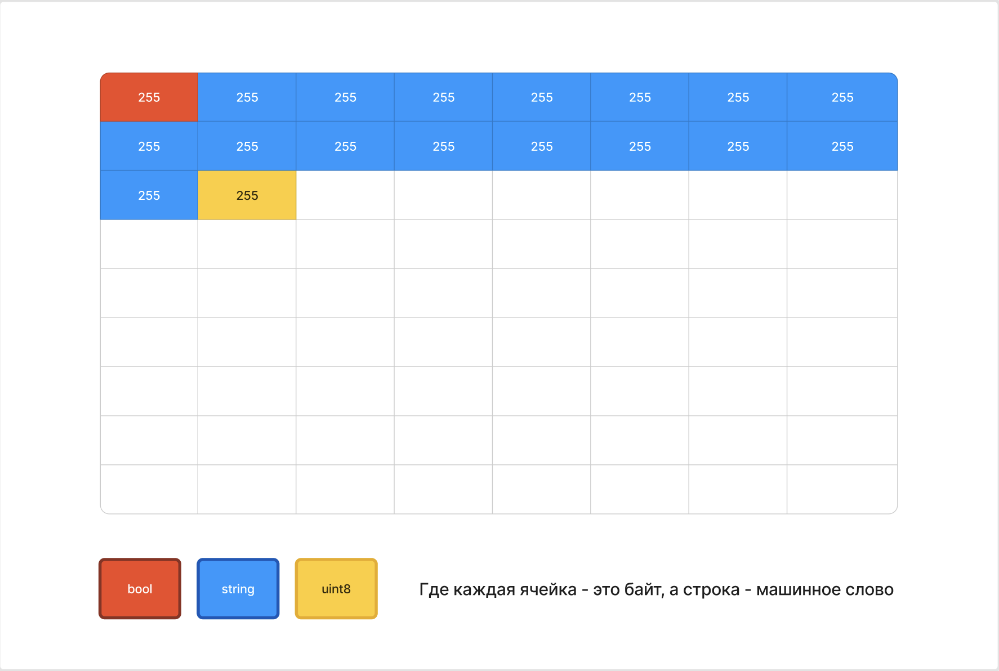
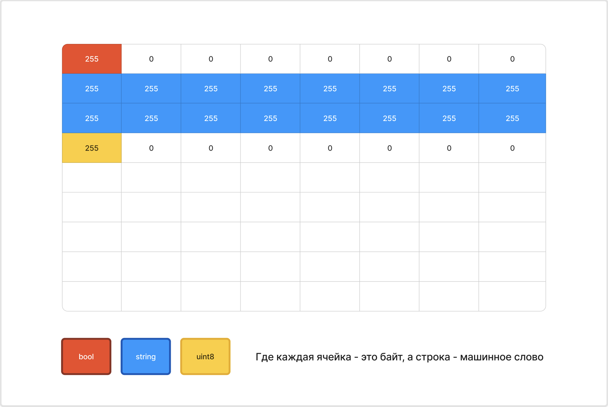
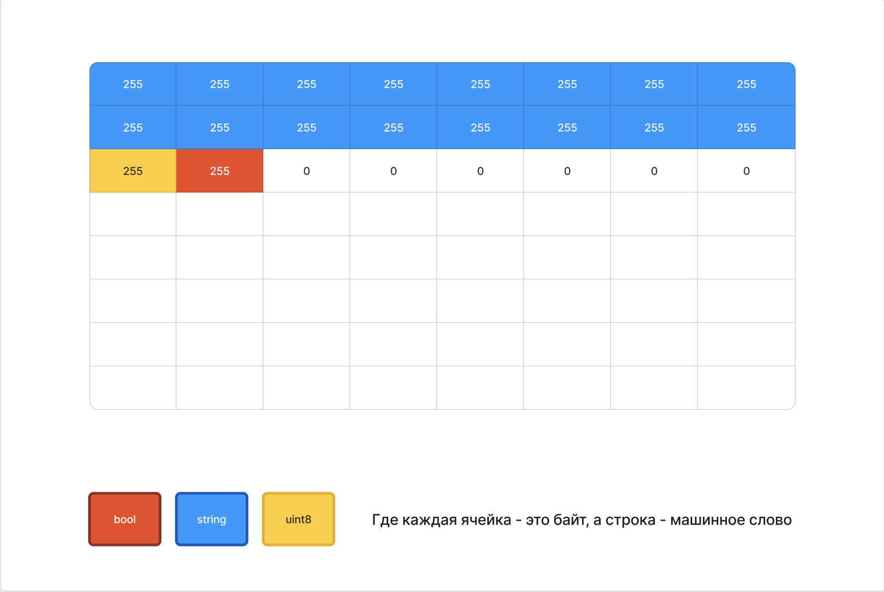

Структуры в Go - это набор именованых полей, служащий для представления каких-либо объектов.

## Объявление структур

Объявлять структуры можно разными способами:

1. Через доступ к самим полям

   ```go
   type Human struct {
   	name string
   	age uint8
   	sex string 
   }
   
   var tom Human
   
   tom.name = "Tom"
   tom.age = 32
   tom.sex = "male"
   ```

2. Через композитные литералы

   :::note 

   **Композитный литерал** -- это запись, состоящая из типа литерала, за которым следует список значений в фигурных скобках. Он создает новый экземпляр указанного типа с инициализацией его значений.

   :::

   1. В этом варианте важно сохранять порядок полей, как они объявлены в самой структуре, важно инициализировать все поля

      ```go
      type Person struct {
      	name string
      	age uint8
      	sex string 
      }
      
      tom := Person{"Tom", 32, "male"}
      ```

   2. В этом варианте не важен порядок, не важно инициализировать поля, потому что в таком случае они изначально принимают нулевое значение типа, но важно в конце оставить висящую запятую

      ```go
      type Person struct {
      		name string
      		age uint8
      		sex string 
      	}
      
      tom := Person{
      		name: "Tom",
      		sex: "male",
      		age: 32,
      	}
      ```

3. Ну и через обычный литерал с явным объявлением

   ```go
   type Person struct {
   		name string
   		age uint8
   		sex string 
   	}
   
   var tom Person = Person{   // Можно указывать тип после имени переменной, можно не указывать
   		name: "Tom",
   		sex:  "male",
   		age:  32,
   	}
   ```

## Особенности

:::note 

**Структуры не являются ссылочным типом**, поэтому также как и массивы **передаются по значению**.

Поэтому, при передаче экземпляра структуры в функцию, если нам нужно изменять оригинал экземпляра, нам нужно передавать его по указателю.

:::

В Go **нет ключевых слов для модификаторов доступа** для переменных, зато есть ЗАГЛАВНЫЕ БУКВЫ!!!11!! (не уверен, что мне это нравится, но да ладно)

```go
type Person struct {
    Name string  // Публичное поле
    sex  int     // Приватное поле
}
```

Заглавные буквы являются аналогом модификатора доступа **public**, справедливо для всех типов данных. Например, структура Person, описанная выше, тоже является публичной, а занчит мы можем её использовать из другого пакета.

Для структур можно определять методы, но об этом в следующей статье “ООП в Go”, так как методы касаются не только структур

## Выравнивание структур

На эту тему (и не только) есть клёвая статья: <https://habr.com/ru/companies/vk/articles/776766/>

Смысл в том, что во время компиляции происходит внутренняя оптимизация структур.

Напоминаю, что процессор может за такт обработать одно машинное слово, что в современных 64 битных процессорах - 8 байт.

Объявим структуру:

```go
type employee struct {
		married bool
		name    string
		age     uint8
	}
```

Возможно, ты подумаешь, что в памяти это расположтится таким образом:



Но такое расположение в памяти не эффективно, так как процессор будет обрабатывать данные по слову, что заставит данные переменной `name` разделиться на 3 куска разной длины, которые надо будет как-то ещё и собирать, а процессор ещё и считает переменную name не за 2 такта, а за 3. Не дело.

Поэтому Go делает struct padding (структурное выравнивание):



То есть байты заполняются нулями, чтобы информация была записана наиболее равномерно относительно размерности машинного слова.

Уже лучше, но вся структура у нас теперь читается за 4 такта + байты заполнились, а значит вес у нас 32 байта, из которых 14 - лишние, а это конские 43.75%. Представил громадные структуры?

**Поэтому перепишем структуру в порядке убывания полей:**

```go
type employee struct {
		name    string
		age     uint8
		married bool
	}
```

Тогда в памяти у нас будет такая картина



Уже всего 3 машинных слова, 24 байта, лишние из которых только 6 (всего 25%)

**Cтоит себе взять в привычку располагать поля в порядке убывания полей**, если структура будет довольно крупной. Если небольшая структурка, которая не будет копироваться много раз, то ~~зачем она вообще~~ можно больше опираться на читаемость кода.

## Структурные теги (JSON, XML)

Теги в структурах Go используются для того, чтобы дать дополнительные инструкции для сериализации и десериализации данных, таких как JSON, XML, Protobuf и других форматов.

Применения:

1. **Переименование полей**: Поля структуры могут иметь имена, отличные от тех, что используются в формате данных.

2. **Пропуск полей**: Некоторые поля могут быть исключены из сериализации или десериализации.

3. **Специальные инструкции по обработке полей**: Теги могут передавать специфичные команды для кодировщиков/декодировщиков.

Структурные теги Go представляют собой аннотации, которые появляются в объявлении структуры Go после типа. Каждый тег состоит из коротких строк, связанных с некоторым соответствующим значением. То есть пары ключ-значение.

Вот как выглядит код сериализации и десериализации для JSON:

```go
package main

import (
	"encoding/json"
	"fmt"
)

type Person struct {
	Name string `json:"full_name"` // Здесь мы задаём другое имя для JSON
	Age  int    `json:"age"`	   // И здесь тоже, потому что регистр другой
}

func main() {
	p := Person{Name: "Alice", Age: 30}

	jsonData, err := json.Marshal(p)
	if err != nil {
		fmt.Printf("Error marshaling struct to JSON: %v\n", err)
		return
	}

	fmt.Println(string(jsonData)) // {"full_name":"Alice","age":30}

	err = json.Unmarshal(jsonData, &p) // Записываем в экземпляр структуры Person данные из JSON
	if err != nil {
		fmt.Printf("Error unmarshaling JSON to struct: %v\n", err)
		return
	}

	fmt.Println(p) // {Alice 30}
}
```

Мы подключили пакет **json** из каталога **encoding**, а затем использовали функции **Marshal()** и Unmarshal() для сериализации и десериализации соответственно.

:::note 

**При отсутсвии тегов названия полей в JSON соответствовали бы названию полей структуры.**

То есть была бы JSON’ка вот такого вида: {“Name”:”Alice”, "Age":30}

:::

Ещё с помощью тегов можно задавать поведение полей при сериализации:

```go
package main

import (
    "encoding/json"
    "fmt"
)

type Person struct {
    Name  string `json:"name"`
    Age   int    `json:"age"`
    Email string `json:"-"`     // Пропускаем поле Email
}

func main() {
    p := Person{Name: "Alice", Age: 30, Email: "alice@example.com"}

    jsonData, err := json.Marshal(p)
	if err != nil {
		fmt.Printf("Error marshaling struct to JSON: %v\n", err)
		return
	}

    fmt.Println(string(jsonData))  // {"name":"Alice","age":30}
}
```

А можно сделать поле опциональным, например:

```go
package main

import (
    "encoding/json"
    "fmt"
)

type Person struct {
    Name  string `json:"name"`
    Age   int    `json:"age,omitempty"`
    Email string `json:"email,omitempty»` // Пропускаем поле, если нулевое значение 
}

func main() {
    p := Person{Name: "Alice", Age: 0, Email: ""}

    jsonData, err := json.Marshal(p)
	if err != nil {
		fmt.Printf("Error marshaling struct to JSON: %v\n", err)
		return
	}

    fmt.Println(string(jsonData))  // {"name":"Alice"}
}
```

Можно задать явно тип полю, например если поле является числом, обычно оно сериализуется как число, но нам надо как строку:

```go
type Person struct {
	Name string `json:"full_name"`
	Age  int    `json:"age,string,omitempty,»` // Делаем строкой, пропускаем, если 0
}

func main() {
	p := Person{Name: "Alice", Age: 30}

	jsonData, err := json.Marshal(p)
	if err != nil {
		fmt.Printf("Error marshaling struct to JSON: %v\n", err)
		return
	}

	fmt.Println(string(jsonData)) // {"full_name":"Alice","age":"30"} 
}
```