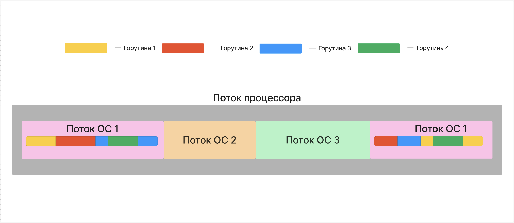
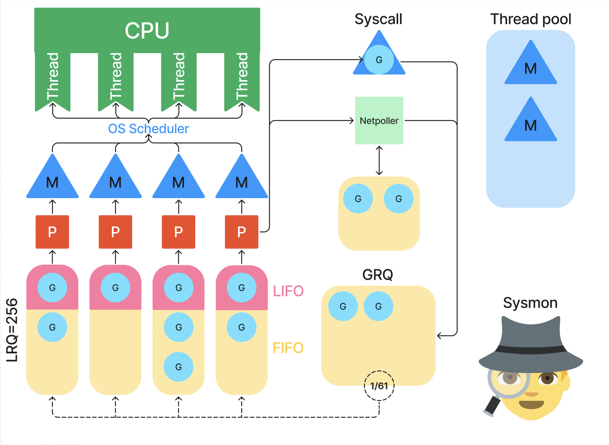

## Вступление

Лично мне проще понимать, как что-то использовать, когда я знаю, как это устроено внутри, такой подход позволяет избегать множества не очевидных, но весьма простых ошибок. А так как я тут пишу материал в первую очередь от себя и для себя, то будь по-моему.

Поэтому сначала поглядим на планировщик, а только после этого поковыряем примеры кода с горутинками.

Не бойся, я постараюсь как можно нагляднее и проще тебе рассказать про то, как горутинки исполняются в рантайме.

**Стоп!** Тут некоторые могут слабо представлять, что из себя представляет рантайм, хотя это было бы кстати для изучения работы планировщика, ща быстренько исправим.

:::info:true Что такое Runtime, зачем нужен, из чего состоит

## Что такое Runtime?

**Runtime** -- это среда исполнения программы, которая предоставляет необходимые инструменты и сервисы для выполнения программы на компьютере. Рантайм работает во время исполнения скомпилированного кода на процессоре.

### Компоненты Go runtime:

1. **Планировщик (Scheduler)**\
   Управляет выполнением горутин, их созданием, приостановкой и планированием на потоках операционной системы.

2. **Аллокатор памяти (Memory Allocator)**\
   Отвечает за выделение и освобождение памяти для выполнения программ Go.

3. **Сборщик мусора (Garbage Collector, GC)**\
   Автоматически освобождает память, которая больше не используется, обеспечивая эффективное управление памятью.

4. **G (Горутина, Goroutine)**\
   Структура данных, представляющая горутину, содержащая состояние выполнения и стек.

5. **M (Машина, Machine)**\
   Поток ОС, который используется для выполнения горутин.

6. **P (Процессор, Processor)**\
   Виртуальная логическая единица, которая распределяет горутины на исполнение, контролируя их выполнение и помогая рантайму эффективно использовать M-thred’ы для выполнения множества горутин.

   Число P обычно равно числу логических процессоров, доступных для приложения, но оно может быть настроено с использованием функции `runtime.GOMAXPROCS()`.

7. **Локальное хранилище потоков (Thread Local Storage)**\
   **TLS** -- это механизм, позволяющий каждому потоку хранить свои уникальные данные. Эти данные остаются привязанными к потоку,

8. **Netpoller**\
   Управляет асинхронными операциями ввода-вывода, обеспечивая возможность горутинам ожидать сетевых и других событий без блокировки.

### Процессы, управляемые рантаймом:

1. **Управление горутинами (Goroutine Management)**\
   Рантайм управляет созданием, выполнением, приостановкой и возобновлением горутин.

2. **Управление стеком (Stack Management)**\
   Рантайм динамически управляет стеками горутин, расширяя или уменьшая их по мере необходимости.

3. **Обработка сигналов (Signal Handling)**\
   Управляет системными сигналами (например, прерываниями) и их распределением для работы горутин.

4. **Рефлексия в рантайме (Runtime Reflection)**\
   Позволяет программе динамически анализировать и изменять структуры данных и типы во время выполнения программы.

5. **Таймеры (Timers)**\
   Рантайм управляет таймерами для выполнения операций с временными задержками, таких как `time.Sleep` и другие функции, связанные с временем.

6. **Обработка panic и recover**\
   Рантайм управляет механизмами для обработки исключений (panic) и их восстановления (recover), что необходимо для управления ошибками в Go.

7. **Синхронизация (Synchronization)**\
   Рантайм управляет внутренними примитивами синхронизации, такими как мьютексы и каналы.

8. **Механизм трассировки (Tracing Mechanism)**\
   Рантайм предоставляет возможности для трассировки и профилирования выполнения программы.

9. **Управление памятью (Memory Management)**\
   Включает управление выделением и освобождением памяти, а также поддержку различных стратегий управления кэшем и памяти.

10. **Планирование асинхронных задач (Asynchronous Task Scheduling)**\
    Управляет асинхронными задачами, связанными с операциями ввода-вывода и другими долгосрочными задачами.

11. **Детектирование гонок (Race Detection):**

    В режиме разработки доступен механизм, который может обнаруживать состояния гонки при использовании горутин, что помогает в выработке более безопасного параллельного кода.

12. **Автоматическая оптимизация производительности и использования памяти:**

    Рантайм Go выполняет внутренние оптимизации, чтобы улучшать общую производительность программы и минимизировать использование ресурсов.

:::

Сам runtime языка описан здесь: <https://github.com/golang/go/tree/master/src/runtime>

:::danger 

Я где-то могу ошибаться, ты просто добавляй **issue** с указанием ошибки и со ссылкой на **правильный** материал.

:::

## Что такое горутина?

**Горутина** - это абстракция внутри абстракции. *Xzibit* **©**

Сейчас объясню!



Вот есть **поток процессора**. Он вполне себе физический, а не абстрактный, так как предоставляет для исполнения инструкций физические юниты.

Есть **поток ОС** (системный поток), который уже является упаковкой для процесса, такая вот абстракция на уровне ядра ОС, которая может исполняться на потоке процессора (исполняя процесс). Системный поток управляется планировщиком ОС.

А есть **горутитна** - легковесный поток, работающий именно внутри рантайма Go, ОС про него ничего не знает, да и горутина не является системным потоком, а всего лишь абстракция на уровне рантайма Go, которая может исполняться на потоке ОС и управляется планировщиком Go. А планировщик Go переключает контекст горутин внутри потока ОС так же, как планировщик ОС переключает контекст потоков ОС внутри потока процессора.

Получается вот такие вот 2 слоя абстракции над потоками процессора.

Горутина исполняется в первую очередь **конкурентно** (**НЕ ПАРАЛЛЕЛЬНО!)**, при этом объявляется горутина ключевым словом `go` перед функцией, но сама горутина – не  функция!

:::note 

Про разницу между параллельностью и конкурентностью я писал в разделе **“База”** в главе **“Операционный системы”**

:::

**Горутина** - это структура внутри рантайма, которая содержит в себе необходимые ресурсы для исполнения кода той функции, перед которой поставили  ключевое слово `go`. Состав структуры горутины довольно широкий, в коде его можно посмотреть вот [тут](https://github.com/golang/go/blob/e9a500f47dadcd73c970649a1072d28997617610/src/runtime/runtime2.go), но самое главное, что там есть **адрес первой инструкции функции** и **стек.**

**Почему горутину постоянно называют легковесным потоком?** Всё потому что стек горутины динамический!

**Минимальный** размер стека горутины аж **2 Кб,** а **максимальный** зависит от разрядности системы: до **1 Гб** для 64 разрядных или до **250 Мб** для 32 разрядных. Однако реальное ограничение может быть меньше в зависимости от конфигурации среды исполнения и других факторов

Системные же потоки имеют **фиксированный** размер, для Windows размер стека обычно 1 МБ. В Linux размер стека для потоков, как правило, составляет от 2 до 8 МБ, в зависимости от дистрибутива и настроек ядра.

Горутина может находиться в трех (основных) состояниях:

-  **Waiting:** В этом состоянии, горутина бездействует. Например встает на паузу для операции с каналами или блокировками, либо может быть остановлена системным вызовом.

-  **Runnable:** Горутина готова к тому чтобы быть исполненной, но еще не исполняется. Она ожидает своей очереди на системном потоке.

-  **Running:** Горутина исполняется на системном потоке. Это будет продолжаться, пока работа не будет выполнена, или до тех пор, пока ее не прервет планировщик, либо что‑то еще ее не заблокирует.

## Планировщик

Как и говорилось выше в блоке про рантайм, Go scheduler управляет работой горутин в рантайме, поэтому нам важно понимать, как он работает, чтобы эффективно ~~проходить собесы~~ писать конкурентный код.

### Machine

**M (Machine)** -- это системный поток, который выполняет код горутин.

Обычное Go приложение может использовать до 10 000 потоков.

Если вы выйдете за рамки этого лимита, есть риск того, что приложение крашнется.

Так же, стоит помнить о том, что потоки переиспользуются, так как создание и удаление потока -- ресурсоемкие операции.

### **Processor**

**P** (Processor) в рантайме Go представляет собой **виртуальную логическую единицу** для выполнения горутин. Это один из ключевых компонентов, участвующих в планировании и выполнении горутин. Именно он связывает горутины (**G**) с системными потоками (**M**). Его основная роль заключается в управлении тем, какие горутины будут выполняться на каком системном потоке, и в распределении ресурсов для этих горутин.

**Основной элемент** **P** -- это **локальная очередь** горутин (Local Run Queue), которая содержит горутины, ожидающие выполнения. Далее я её буду называть LRQ.

### LRQ

**LRQ** состоит из двух очередей: **LIFO** и **FIFO**.

:::info:true Что за FIFA?

**Очереди** **( FIFO)** -- «первый пришел и первый ушел» (First in First out). Принцип FIFO означает: сущность, которая первая попала в очередь, первым же отправляется на обработку.

**Стеки (LIFO)** -- «пришел последним, а ушел первым» (Last in First out). В отличие от системы FIFO, стек можно представить в виде стопки тарелок: вы кладете тарелки друг на друга и сначала берете верхние тарелки.

:::


Когда горутинка попадает в LRQ, она сначает в LIFO часть очереди, но место там только для одной горутины, поэтому остальные попавшие в очередь горутины вытесняют оттуда первую горутинку и в LIFO остаётся **последняя вошедшая** в LRQ горутина. Остальные попадают в FIFO.  Поэтому из очереди исолняется **сначала последняя вошедшая** горутина, а **затем в порядке очереди**.

Например вот код:

```go
package main

import (
	"fmt"
	"runtime"
	"sync"
)

func main() {
	runtime.GOMAXPROCS(1)

	wg := sync.WaitGroup{}
	
	for i := 0; i < 5; i++ {
		wg.Add(1)
		go func(i int) {
			defer wg.Done()
			fmt.Println(i)
		}(i)
	}

	wg.Wait()
}
```

Вывод по выше описанным причинам будет такой:

```
4
0
1
2
3
```

**А нужно это вот по какой причине:** довольно большой шанс, что последняя вошедная в очередь горутина уже исполнялась, потом прервалась, а теперь снова попала в очередь. А значит скорее всего данные этой горутинки уже закешированы в процессоре, что даст последней вошедшей горутинке значительно сократить время восстановления контекста и продолжить выполнение с минимальной задержкой, чем если бы она исполнилась в порядке очереди. Это суммарно уменьшает время исполнения всех горутин.

У **LRQ** есть **вместительность**, обычно она составляет **256 горутин**.

### Процесс работы горутины, модель GMP



#### GMP, LRQ, GRQ

Например, мы создали горутинку, она планировщиком назначается какому-то процессору **P** и кладётся в очередь **LRQ,** принадлежащую этому процессору **P**.

**P –** по сути менеджер, он решает вопросы распределения ресурсов своей очереди, **P** всегда должен быть привязан к какому-то потоку **M**, в который он уже кладёт  горутинки.

Вот и нашей горутинке процессор **P** велел идти исполняться на системном потоке **M,** за которым закреплён этот **P.**

Когда квант времени горутины завершается или горутина блокируется, поток **M** сохраняет её контекст  в структуру данных горутины, а горутинка отправляется обратно в **LRQ**, если там есть местно, конечно. Если ни в одном **LRQ** места нет, горутинка вынуждена проследовать в глобальную очередь **GRQ** (Global Run Queue).

#### Системный вызов

Горутина может выполнить **системный вызов**. Если ничего не знаешь про них, крайне рекомендую почитать в разделе “**База**”, в статье “**Операционные системы**”!

В случае системного вызова системный поток переходит в режим ядра, а планировщик Go знать не знает, что там происходит внутри и как скоро поступит ответ. А пока не поступит ответ на вызов, поток будет заблокирован, а остальные горутинки будут ждать, пока поток разблокируется. Чтобы избежать такого ожидания, у планировщика есть хитрые механизмы управления такими ситуациями.

Когда горутина исполняет системный вызов (например, чтение данных с диска или сетевую операцию), Go планировщик **не сразу** отвязывает **M** поток от **P** процессора. Он ожидает, что этот вызов будет **короткоживущим** (short-lived syscall), и не хочет тратить ресурсы на перераспределение задач. Это сделано для оптимизации -- если вызов действительно быстро завершится, то перепривязывать ресурсы не имеет смысла.

Если системный вызов **затягивается**, и поток долго остаётся заблокированным, вмешивается новый персонаж, фоновый поток – **sysmon**. Он обнаруживает, что поток **M** «застрял» на системном вызове и инициирует **отвязку** этого потока от процессора **P**. И затем для процессора **P** либо берётся новый поток **M** из пула потоков, либо, если в пуле пусто, создаётся новый, чтобы горутинки в его очереди могли спокойно исполняться.

:::info 

В Go **sysmon** (системный монитор) -- это фоновый системный поток, который играет важную роль в управлении временем выполнения программы. Он отвечает за мониторинг и оптимизацию работы горутин, планировщика, сборщика мусора и системных ресурсов.

:::

Как только горутина получит ответ на системный вызов, исполняясь на отвязанном потоке, горутина, может **вернуться** **обратно** в ~~Коноху~~ свою родную очередь **LRQ** к своему родному процессору **P, но только если поток M, связанный с процессором** **P не выолняет системный вызов и есть место в LRQ!** Иначе горутинка отправляется в **глобальную очередь GRQ.**

А поток, на котором исполнялась эта горутинка, отправляется в **Tread Pool** (пул потоков).

Пул потоков нужен, чтобы не пересоздавать потоки, потому что это довольно дорого, вместо этого планировщик старается переиспользовать уже созданные потоки, для этого свободные потоки хранятся в пуле потоков.

#### Сетевой вызов

Если горутина выполняет сетевой вызов, например HTTP запрос, то горутинка приостанавливается и отвязывается от **P**, перемещаясь в структуру планировщика, которая называется **список приостановленных горутин**, попутно регистрируясь в **netpoller** для ожидания события ввода-вывода.

Когда **netpoller** получает сигнал от системы, что ожидаемое событие произошло (например, данные готовы для чтения), он уведомляет планировщик. Планировщик Go затем извлекает горутину из списка ожидания и снова ставит её в **LRQ** для выполнения на одном из логических процессоров **P**. Если ни в одном **LRQ** места нет, горутинка вынуждена проследовать в глобальную очередь **GRQ.**

**Netpoller** позволяет Go эффективно управлять сетевыми запросами, не блокируя системные потоки.

В зависимости от операционной системы, **Netpoller** использует разные механизмы:

-  На Linux -- это **epoll**.

-  На macOS и BSD-системах -- **kqueue**.

-  На Windows -- это **IOCP** (I/O Completion Port)