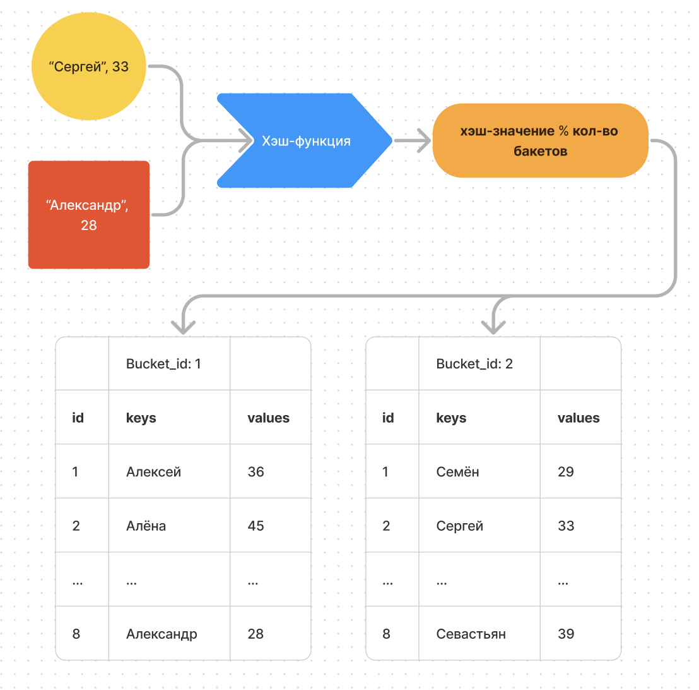
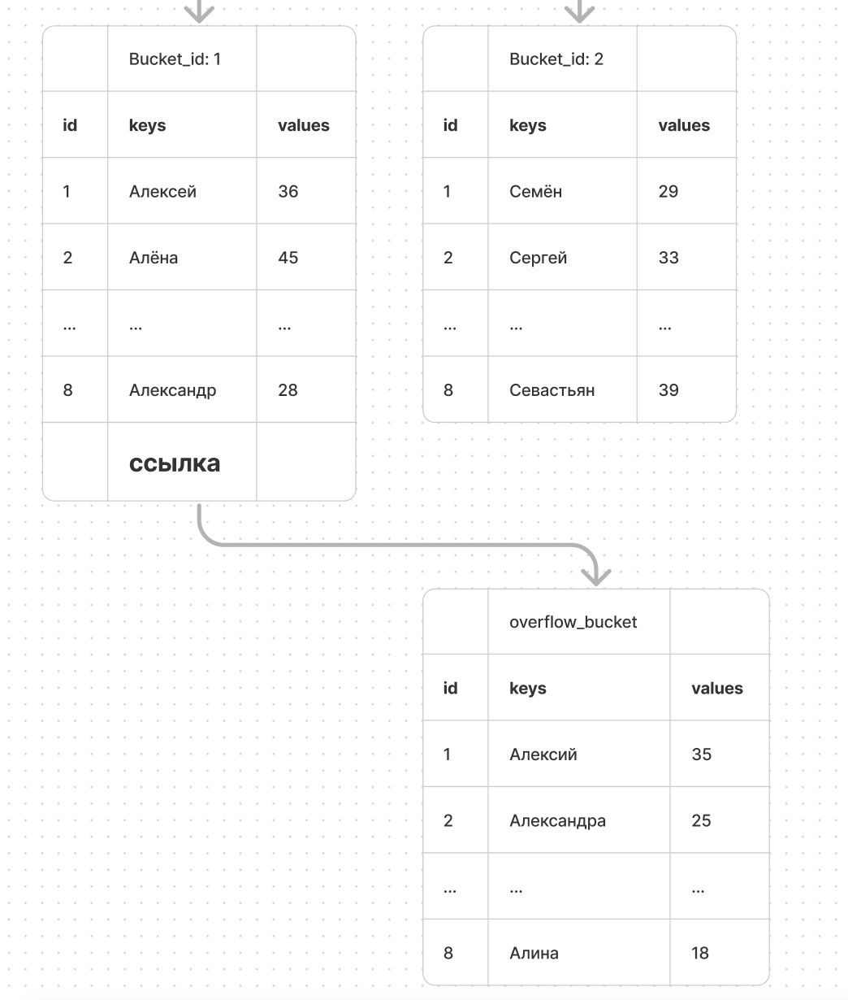

Это ещё более сложная структура данных, чем слайсы, так что приготовься морально перечитывать по нескольку раз 1 абзац (если не шаришь).

## Если просто

Мапа в Go ялвляется реализацией хэш-таблиц в ЯП Go.

Хэш-таблица обеспечивает:

-  быстрый доступ к данным за константное время O(1)

-  эффективное использование памяти

-  универсальность (хранение различных типов данных как в качестве ключа, так и значения)

Быстрый доступ в хэш-таблице обеспечивается хэш-функцией, которая вычисляет хэш, оттуда и название (подробнее ниже)

Мапа в Go по сути похожа на слайс, где каждый его элемент из себя представляет пару ключ-значение. То есть итерируясь по мапе, мы будем получать ключ и значение по этому ключу.

Схематично можно представить мапу так:

```
[{key0, value0}, {key1, value1}, … {keyN, valueN}]
```

Создаём мы мапу, объявляя типы для ключа и значения (то есть типы могут быть любыми допустимыми, но фиксированными для одной мапы) + возможна инициализация

### Типы данных для ключей:

-  **Все числовые типы** (int, int8, int16, int32, int64, uint, uint8, uint16, uint32, uint64, float32, float64, complex64, complex128)

-  **Строки** (string)

-  **Булевы значения** (bool)

-  **Указатели** (\*T)

-  **Интерфейсы** (interface{})

-  **Структуры** (если все поля структуры могут быть сравнены с помощью `==`)

-  **Массивы** (если элементы массива могут быть сравнены с помощью `==`)

### Не могут быть использованы в качестве ключей:

-  **Срезы** (slice)

-  **Карты** (map)

-  **Функции** (func)

Ключи мапы должны быть сравниваемыми типами данных, т.е. которые можно сравнивать с помощью оператора `==`. Это необходимо для обеспечения корректности операций добавления, удаления и поиска элементов в мапе.

### Типы данных для значений map:

Значения в мапе могут быть любого типа, включая:

-  **Все числовые типы** (int, int8, int16, int32, int64, uint, uint8, uint16, uint32, uint64, float32, float64, complex64, complex128)

-  **Строки** (string)

-  **Булевы значения** (bool)

-  **Указатели** (\*T)

-  **Интерфейсы** (interface{})

-  **Структуры** (struct)

-  **Массивы** (array)

-  **Срезы** (slice)

-  **Карты** (map)

-  **Функции** (func)

-  **Каналы** (chan)

-  **Интерфейсы** (interface{})

### Объявление мапы

```
m := map[string]int {      // Объявление с инициализацией
	"Один": 1,
	"Два": 2,
	"Три": 3,              // Обращаю внимание на висящую запятую, без неё синтаксическая ошибка
} 

m := make(map[string]int)      // Объявление пустой мапы, при выводе будет: map[]

m := make(map[string]int, 10)  // Пустая мапа с заданой ёмкостью для оптимизации аллокации памяти

var m map[string]int           // Не инициализированная мапа со значение nil

var m map[string]int{}         // Вызовет синтаксическую ошибку 
// так как объявление с инициализацией требует указания значний как в первом примере
```

После объявления мапы давайте с ней поработаем

### Работа с мапой

:::danger 

Очень важно помнить, что мапа не является упорядоченной! То есть порядка последовательности в ней не сохраняется, подробнее ниже

:::

#### Итерация по мапе:

```
m := map[string]int {
	"Один": 1,
	"Два": 2,
	"Три": 3,
} 

for key, value := range(m) {
	fmt.Println(ket, value)
}
```

#### Добавление или обновление элемента:

```
m["Четыре»] = 4
```

#### Удаление элемента:

```
delete(m, "четыре")
```

#### Получение значения по ключу:

```
value := m["три»] // 3
```

#### Проверка наличия ключа в мапе:

```
value, ok := m["три"] // 3, true

value, ok = m["пять"] // 3, false
```

## Если посложнее

Сама по себе мапа по сути является **массивом бакетов**. 

Бакеты используются для сортировки ключ-значений по определённому признаку (об этом в нижнем разделе) и **хранят в себе до 8 пар ключ-значение**.

Нужно это для более быстрого поиска (разделяй и властвуй)

Для простоты понимания давайте представлять мапу пока что вот так:

```
type bmap struct {
	keys     [8]string  // массив ключей
    values   [8]int     // массив значений
}

type map []bmap // мапа (:
```

То есть массив бакетов, хранящих до 8 ключ-значений.

Например, если при поиске значения мы находим ключ, совпадающий с указанным, то по id массива `keys` этого ключа, мы достаём элемент из массива `values`

В реальности Go использует нечто более сложное для представления ключей и значений в бакетах, но для упрощения сойдёт.

### Хэш-функция

Но как мапа позволяет иметь такой быстрый доступ к данным, итерируясь не по индексу, а по ключу? Допустим, у нас в качестве ключа указана строка, сравнивать строки дольше, чем индексы.

Всё верно, но поиск по мапе и производится как раз по индексу. **Всё дело в хэш-функции**

Когда вы добавляете или ищете элемент по ключу (например, строке), хэш-функция (для нас это чёрная коробка, разрабы не раскрывают реализацию) преобразует этот ключ в хэш-значение. Полученное хэш-значение делится по модулю на количество бакетов, чтобы получить индекс бакета, в который будет помещен элемент.  

В найденный бакет ключ-значение попадает в первую свободную ячейку.

:::danger 

Самое главное, что **нет никаких гарантий** того, что элемнет после перезапуска программы снова попадёт в ту же ячейку, что и при первом запуске! 

Из-за специфики расчёта индекса бакета, **мапы в Go** **не сохраняют порядок вставки** элементов. 

Порядок извлечения элементов из мапы может отличаться от порядка их вставки.

Для каждого запуска программы **используется случайный seed для хэш-функции**, что **рандомизирует распределение**, по сути создавая каждый раз новые хэш-значения для одних и тех же ключей (подробнее ниже), а значит **распределяет их по разным бакетам**, куда они могут попадать в ином порядке

**Именно поэтому мапа не является упорядоченной!** 

:::

### Например, создадим мапу с ключом - именем, а значением - возрастом:



:::info 

Схема максимально упрощённая. Так, тут опускается структура мапы, строение бакета, вычисление id бакета, используя маску и т.д., чтобы твой мозг не попросился сразу наружу. Для любителей экзотики вся эта информация будет ниже.

:::

Это работает очень хорошо до момента, пока у нас не будет очень много ключей. В таком случае хэш-функция не сможет дать всем ключам уникальные хэш-значения.

То есть хэш-функция для  некоторых ключей может вычислить  одинаковые хэш-значения, и произойдёт так называемая **коллизия**.

Есть разные методы решения коллизий, не буду заострять на этом внимание, разберём, как это работает в Go.

### Коллизии

Коллизия в общем смысле - это столкновение. В нашем случае столкновение одинаковых значений хэшей. Для решения коллизий элемент (ключ-значение) помещается в  overflow бакет, а ссылка на этот overflow бакет сохраняется в исходном бакете.

Такой метод решения коллизий называется метод цепочек (chaining).

 

Это справедливо и для переполнения бакета. Когда для нового ключ-значения уже не хватает места в бакете, он отправляется в overflow бакет.

Один бакет может хранить одну ссылку на overflow бакет.



При этом сам overflow бакет может тоже хранить ссылку на другой overflow бакет в случае коллизий, и так далее, тут жёстких ограничений на стороне реализации Go нет.

Тут и кроется опасность, когда злоумышленник может подобрать входные данные таким образом, чтобы порождать огромное количество коллизий, что может замедлить или даже парализовать работу системы. Но и тут у мапы есть решение, но об этом ниже.

## Если совсем сложно

Подробнее: <https://github.com/golang/go/blob/master/src/runtime/map.go>

Подробное строение мапы нужно только ради любопытства, а для большинства задач хватит понимания того, что метод оптимизации работы с мапой такой же, как и со слайсом - заранее аллоцируем память, если мапа может активно расти.

Хотя, если обращение к мапе не будет таким частым, то внутренних оптимизаций мапы хватит, и не обязательно выделять заранее конкретное число элементов.

Но если интерес всё-таки берёт верх, то всё же немного приоткроем капот, чтобы понять, как там шестерёнки двигаются:

Сама мапа состоит из 2 структур под названием header и bucket

```Go
type hmap struct {
	count     int   
	flags     uint8  
	B         uint8  
	noverflow uint16 
	hash0     uint32 
	buckets    unsafe.Pointer 
	oldbuckets unsafe.Pointer 
	nevacuate  uintptr        
	extra *mapextra
}
```

```Go
type bmap struct {
    tophash  [8]uint8       // массив дополнительных битов хэша для каждой пары ключ-значение
    keys     [8]string      // массив ключей
    values   [8]int         // массив значений
    overflow *bmap          // указатель на overflow бакет
}
```

## Header

**Count** - это размер мапы, количество элементов, используется функцией `len()`

**Flags** - флаги используются для хранения состояния мапы. 

Флаги помогают Go-runtime эффективно управлять состоянием мапы, особенно в многопоточных и динамически изменяющихся средах.

```Go
const (
    iterator      = 1 << iota // 00000001 - мапа в процессе итерации
    oldIterator               // 00000010 - используется старая версия мапы для итерации при росте
    hashWriting               // 00000100 - запись в мапу в процессе
    sameSizeGrow              // 00001000 - мапа растет без изменения числа бакетов
)
```

**B** - 