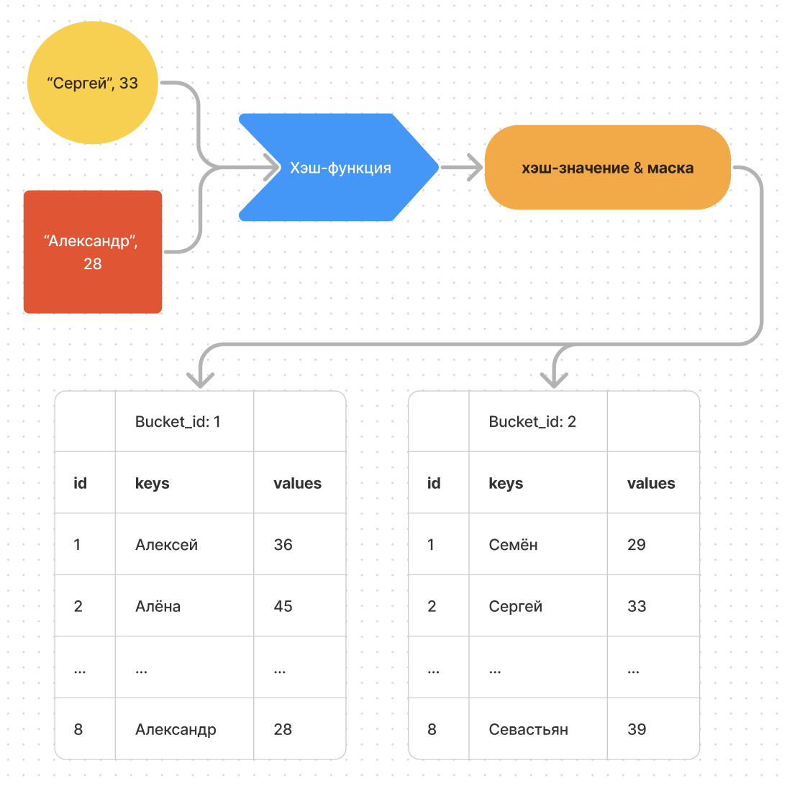
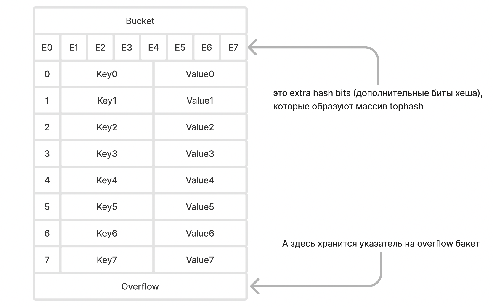
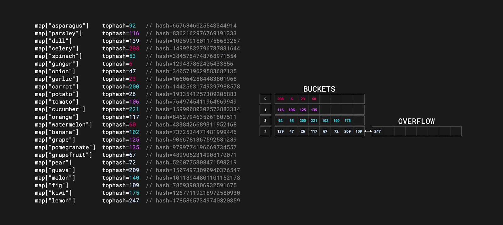

**Aka** **хеш-таблица, aka хеш-мапа, aka словарь, aka** **ассоциативный массив (как много у него имён)**

Это ещё более сложная структура данных, чем слайсы, так что приготовься.

## Если просто

Мапа в Go ялвляется реализацией хеш-таблиц в ЯП Go.

Хеш-таблица обеспечивает:

-  быстрый доступ к данным за константное время O(1) (ну почти)

-  эффективное использование памяти

-  универсальность (хранение различных типов данных как в качестве ключа, так и значения)

Быстрый доступ в хеш-таблице обеспечивается хеш-функцией, которая вычисляет хеш, оттуда и название (подробнее ниже).

Далее мы с тобой будем постоянно формировать представление мапы в голове, от простого к сложному, так что на протяжении всего чтива она будет менять свой облик, но зато тебе будет легче так воспринимать её.

Для начала держи её объявление (подробнее ещё обсудим):

```go
m := map[string]int {  
	"Один": 1,
	"Два": 2,
	"Три": 3,    
} 
```

Мапа в Go по сути похожа на массив, где каждый его элемент из себя представляет пару ключ-значение. То есть, итерируясь по мапе, мы будем получать ключ и значение по этому ключу.

Создаём мы мапу, объявляя типы для ключа и значения (то есть типы могут быть любыми допустимыми, но фиксированными для одной мапы) + возможна инициализация при объявлении.

:::danger 

**Важно помнить, что мапа передаётся “по ссылке”, а не по значению**

:::

### Типы данных для ключей:

-  **Все числовые типы** (int, int8, int16, int32, int64, uint, uint8, uint16, uint32, uint64, float32, float64, complex64, complex128)

-  **Строки** (string)

-  **Булевы значения** (bool)

-  **Указатели** (\*T)

-  **Интерфейсы** (interface\{})

-  **Структуры** (если все поля структуры могут быть сравнены с помощью `==`)

-  **Массивы** (если элементы массива могут быть сравнены с помощью `==`)

### Не могут быть использованы в качестве ключей:

-  **Срезы** (slice)

-  **Карты** (map)

-  **Функции** (func)

Ключи мапы должны быть сравниваемыми типами данных, т.е. которые можно сравнивать с помощью оператора `==`. Это необходимо для обеспечения корректности операций добавления, удаления и поиска элементов в мапе.

### Типы данных для значений map:

Значения в мапе могут быть любого типа, включая:

-  **Все числовые типы** (int, int8, int16, int32, int64, uint, uint8, uint16, uint32, uint64, float32, float64, complex64, complex128)

-  **Строки** (string)

-  **Булевы значения** (bool)

-  **Указатели** (\*T)

-  **Интерфейсы** (interface\{})

-  **Структуры** (struct)

-  **Массивы** (array)

-  **Срезы** (slice)

-  **Карты** (map)

-  **Функции** (func)

-  **Каналы** (chan)

-  **Интерфейсы** (interface\{})

### Объявление мапы

```go
m := map[string]int {      // Объявление с инициализацией
	"Один": 1,
	"Два": 2,
	"Три": 3,              // Обращаю внимание на висящую запятую, без неё синтаксическая ошибка
} 

m := make(map[string]int)      // Объявление пустой мапы, при выводе будет: map[]

m := make(map[string]int, 10)  // Пустая мапа с заданой ёмкостью для оптимизации аллокации памяти

var m map[string]int           // Не инициализированная мапа со значение nil

var m map[string]int{}         // Вызовет синтаксическую ошибку 
// так как объявление с инициализацией требует указания значний как в первом примере
```

После объявления мапы давайте с ней поработаем.

### Работа с мапой

:::danger 

Очень важно помнить, что мапа не является упорядоченной! То есть последовательности в ней не сохраняется, подробнее ниже!

:::

#### Итерация по мапе:

```go
m := map[string]int {
	"Один": 1,
	"Два": 2,
	"Три": 3,
} 

for key, value := range(m) {
	fmt.Println(key, value)
}
```

#### Добавление или обновление элемента:

```go
m["Четыре»] = 4
```

#### Удаление элемента:

```go
delete(m, "четыре")
```

#### Получение значения по ключу:

```go
value := m["три»] // 3
```

#### Проверка наличия ключа в мапе:

```go
value, ok := m["три"] // 3, true

value, ok = m["пять"] // 3, false
```

## Если посложнее

Мапа содержит в себе **массив бакетов**.

Бакеты используются для сортировки ключ-значений по определённому признаку (об этом в нижнем разделе) и **хранят в себе до 8 пар ключ-значение**.

То есть такие корзинки для сортировки с восемью ячейками.

Нужно это для более быстрого поиска (разделяй и властвуй).

Но сортировка эта работает не по значению или содержанию ключа, так что и не надейся, **в мапе нет порядка, есть только хаос!)**

Для простоты понимания, давай представлять мапу пока что вот так:

```go
type bmap struct {
	keys     [8]string  // массив ключей
    values   [8]int     // массив значений
}

type map []bmap // мапа (:
```

То есть массив бакетов, хранящих до 8 ключ-значений.

В нашей схеме это работает так: если при поиске значения мы находим в мапе ключ, совпадающий с указанным, то по id массива `keys` этого ключа, мы достаём элемент из массива `values`

В реальности же Go использует нечто более сложное для представления ключей и значений в бакетах, но для упрощения понимания сойдёт.

### хеш-функция

Но как мапа позволяет иметь такой быстрый доступ к данным, итерируясь не по индексу, а по ключу? Допустим, у нас в качестве ключа указана строка, сравнивать строки дольше, чем индексы.

Всё верно, но поиск по мапе и производится как раз по индексу. **Всё дело в хеш-функции**

Когда вы добавляете или ищете элемент по ключу (например, строке), хеш-функция (для нас это чёрная коробка, разрабы не раскрывают реализацию) преобразует этот ключ в хеш-значение. Полученное хеш-значение (по сути) делится по модулю, чтобы получить индекс бакета, в который будет помещен элемент.

В найденный бакет ключ-значение попадает в первую свободную ячейку.

:::danger 

Самое главное, что **нет никаких гарантий** того, что элемнет после перезапуска программы снова попадёт в ту же ячейку, что и при первом запуске!

Из-за специфики расчёта индекса бакета, **мапы в Go** **не сохраняют порядок вставки** элементов.

Порядок извлечения элементов из мапы может отличаться от порядка их вставки.

Для каждого запуска программы **используется случайный seed для хеш-функции**, что **рандомизирует распределение**, по сути создавая каждый раз новые хеш-значения для одних и тех же ключей (подробнее ниже), а значит **распределяет их по разным бакетам**, куда они могут попадать в ином порядке.

**Именно поэтому мапа не является упорядоченной!**

:::

### Ради примера создадим мапу с ключом - именем, а значением - возрастом:



:::info 

Схема максимально упрощённая. Так, тут опускается структура мапы, строение бакета, вычисление id бакета по маске и т.д., чтобы твой мозг не попросился сразу наружу. Для любителей экзотики вся эта информация будет ниже.

:::

Это работает очень хорошо до момента, пока у нас не будет много ключей. В таком случае хеш-функция не сможет дать всем ключам уникальные хеш-значения.

То есть хеш-функция для  некоторых ключей может вычислить  одинаковые хеш-значения, и произойдёт так называемая **коллизия**.

### Коллизии

Коллизия в общем смысле - это столкновение. В нашем частном случае - столкновение одинаковых значений хешей.

Для решения коллизий, элемент (ключ-значение) помещается в  overflow бакет, а ссылка на этот overflow бакет сохраняется в исходном бакете.

Такой метод решения коллизий называется метод цепочек (chaining).

В природе существуют и другие методы решения коллизий, помимо метода цепочек, но я не буду заострять на этом внимание, остановимся на том, как это работает в Go.

**Сhaining** справедлив и для переполнения бакета. Когда для нового ключ-значения уже не хватает места в бакете, он отправляется в overflow бакет.

Один бакет может хранить одну ссылку на overflow бакет.


При этом сам overflow бакет может тоже хранить ссылку на другой overflow бакет в случае коллизий и переполнений, и так далее, жёстких ограничений на стороне реализации Go нет.

Тут и кроется опасность, когда злоумышленник может подобрать входные данные таким образом, чтобы порождать огромное количество коллизий, что может замедлить или даже парализовать работу системы. Но и тут у мапы есть решение, но об этом ниже.

## Если совсем сложно

Подробнее: <https://github.com/golang/go/blob/master/src/runtime/map.go>

#### Небольшое предисловие

По ссылке выше будет актуальная информация реализации map, так как она может незначительно измениться, и ниже может оказаться не актуальная информация.

Подробное строение мапы нужно только ради любопытства (ещё на собесах любят гонять по этой штуке), а для большинства задач хватит понимания того, что метод оптимизации работы с мапой такой же, как и со слайсом - заранее аллоцируем память, если мапа может активно расти, иначе запустится процесс эвакуации, который на некоторое количество операций замедлит работу map + лишняя нагрузка на железо.

Хотя, если обращение к мапе не будет таким частым, то внутренних оптимизаций мапы хватит, и не обязательно выделять заранее конкретное число элементов.

Но если таки интерес берёт верх, то всё же немного приоткроем капот, чтобы понять, как там шестерёнки двигаются.

#### Сразу посмотрим структуру

Сама мапа состоит из 2 структур под названием **header** (hmap) и **bucket** (bmap)

```go
type hmap struct {
	count     int   
	flags     uint8  
	B         uint8  
	noverflow uint16 
	hash0     uint32 
	buckets    unsafe.Pointer 
	oldbuckets unsafe.Pointer 
	nevacuate  uintptr        
	extra *mapextra
}
```

```go
type bmap struct {
    tophash  [8]uint8       // массив дополнительных битов хеша для каждой пары ключ-значение
    keys     [8]string      // массив ключей
    values   [8]int         // массив значений
    overflow *bmap          // указатель на overflow бакет
}
```

## Header

### **Count**

Это размер мапы, количество элементов, используется функцией `len()`

### **Flags**

Используются для хранения состояния мапы. Флаги помогают Go-runtime эффективно управлять состоянием мапы, особенно в многопоточных и динамически изменяющихся средах.

Вот как флаги выглядят в официальном гите:

```go
const (
    iterator      = 1 << iota // 00000001 - мапа в процессе итерации
    oldIterator               // 00000010 - используется старая версия мапы для итерации при росте
    hashWriting               // 00000100 - запись в мапу в процессе
    sameSizeGrow              // 00001000 - мапа растет без изменения числа бакетов
)
```

### B

Это поле заслуживает отдельного подробного разъяснения.

**B** - это **log_2(numBuckets)**, то есть логарифм по основанию 2 от количества бакетов.

Значит 2 в степени B = количество бакетов.

То есть и на самом значении **B** подвязано **количество бакетов**, и наоборот.

Это очень важный для мапы параметр. Он очень удобен для разного рода процессов в мапе. Например, он используется для вычисления индекса путём побитовых операций.

Как описывалось выше, индекс основывается на хеш-значении. А происходит это **при помощи маски**.

**Например:**

Допустим у нас **B = 3**, а значит у нас **8 бакетов**, а хеш-значение предположим такое: **0xA1B2C3D4**

Тогда вычисления будут следующими:

```go
mask := (1 << B) - 1 // 7
index := hashValue & mask // 4
```

:::info 

**“\<\<“ –** это битовая операция, которая сдвигает значение слева на количество бит, указанных значением справа, работает это в двоичной системе, в нашем случае процесс выглядит так:

КУРСИВОМ УКАЗАНЫ ЧИСЛА В ДВОИЧНОМ ПРЕДСТАВЛЕНИИ

\*\*mask = (1 \<\< 3) - 1 = (*0001* \<\< 3) - 1 = *1000* - 1 = 8 - 1 = 7 = *0111*

**hashValue = 0xA1B2C3D4 = *1010 0001 1011 0010 1100 0011 1101 0100***

**index = hashValue & mask = *100* = 4**

Побитовое **&** (и) работает по сути как и логическое **&&**: каждая цифра (бит) в соответствующих позициях двух чисел сравнивается, если обе цифры в текущем разряде равны `1`, то в результате для этого разряда будет `1`. Если хотя бы одна цифра в текущем разряде равна `0`, то в результате для этого разряда будет `0`

**1010  0001  1011   0010  1100  0011  1101   0100** (hashValue)

**&**

**0000 0000 0000 0000 0000 0000 0000 0111**  (mask)

---

**0000 0000 0000 0000 0000 0000 0000 0100** (результат = 4)

:::

Все эти расчёты по сути равны тем, что описаны в упрощённой схеме, то есть как бы делим по модулю хеш-значение (в десятичном представлении) на количество бакетов и получаем тот же результат.

Просто **побитовые операции быстрее** классических математических.

И как раз для побитовых операций удобно иметь число, которое является степенью двойки.

Более того, процесс роста мапы обычно её удваивает, а так как **B** является степенью двойки, то мы можем просто прибавлять к **B** единичку, и мапа увеличится вдвое. О процессе роста ниже.

:::info 

1 \<\< N - это наиболее быстрый для процессора аналог возведения двойки в степень N, так как побитовая операция производится за один такт процессора, а математическая - за несколько.

:::

### noverflow

**noverflow** хранит в себе количество overflow бакетов.

Используется для того, чтобы отслеживать количество overflow бакетов и инициировать рост мапы, если количество overflow бакетов становится слишком большим.

**noverflow может хранить в себе как точное, так и приблизительное количество бакетов:**

1. **Точное значение**: Когда количество бакетов невелико (меньше 1\<\<16 = 65536), `noverflow` хранит точное количество overflow бакетов.

2. **Приблизительное значение**: Когда количество бакетов велико (больше или равно 1\<\<16), `noverflow` хранит приблизительное количество overflow бакетов. Это сделано для экономии памяти, так как точный подсчет overflow бакетов, при таком их количестве, требует больше ресурсов и времени.

### hash0

**hash0** хранит в себе **seed-значение** для хеш-функции. Он применяется к хеш-значению, что делает индексирование бакетов рандомным.

**Hash0** инициализируется для мапы **рандомным значением** при запуске программы. Поэтому важно понимать следующее: во-первых, **для каждой мапы своё seed-значение**, а во-вторых, после перезапуска программы **элементы будут распределены иначе**, нежели до этого.

Да, именно об этом **seed** я писал выше. Он - одна из главных причин беспорядков в мапе.

Но роль seed очень важна для мап, так как он позволяет распределять данные более равномерно по бакетам, а также это защищает систему от DDOS атак по коллизиям. Как это работает?

Злоумышленник подбирает входные данные так, чтобы создавать множество коллизий, которые будут заставлять мапу использовать память неэффективно, при этом постоянно находясь в процессе роста, что может замедлить или даже парализовать систему.

### buckets

Указатель на массив бакетов мапы. Если поле **count** равно нулю, то **buckets = nil.**

### oldbuckets

Указатель на массив предыдущих бакетов. Используется при росте мапы.

### nevacuate

Количество эвакуированных бакетов, используется в процессе роста мапы, о котором подробнее будем говорить, как всегда, ниже.

### extra

Указатель на структуру **mapextra**, которая выглядит так:

```go
type mapextra struct {
	overflow *[]*bmap
	oldoverflow *[]*bmap
	nextOverflow *bmap
}
```

**overflow** - указатель на массив указателей на overflow бакеты

**oldoverflow** - указатель на массив указателей на overflow бакеты из предыдущей версии этой мапы (как легко догадаться, используется при росте мапы)

**nextOverflow** - указатель на один пустой overflow бакет, который затем выделится для решения коллизии, ускоряя этот процесс.

В общем, структура **mapextra** предоставляет вспомогательные поля, которые помогают оптимизировать работу с overflow бакетами, особенно при росте мапы и при частом добавлении новых элементов, обеспечивая более эффективное управление паматью и уменьшение задержек при перераспределении элементов.

## Bucket

Продублирую, как можно представить эту структуру в коде:

```go
type bmap struct {
    tophash  [8]uint8       // массив дополнительных битов хеша для каждой пары ключ-значение
    keys     [8]string      // массив ключей
    values   [8]int         // массив значений
    overflow *bmap          // указатель на overflow бакет
}
```

А вот для визуалов:



На картинке E - дополнительные биты хеша.

Это и есть массив `tophash`, где его каждый элемент - 8 старших бит хеш-значения ключа.

То есть для `Key0` первые 8 бит его хеш значения будут храниться в `E0` и так далее.

Нужно это для того, чтобы при поиске элемента в мапе не сравнивать сразу значения искомого ключа с теми, что находятся в бакете, что будет занимать достаточно много времени, а для начала посмотреть в массиве, может вообще такого хеша нет, тогда нужно прыгать в overflow бакет по ссылке, чтобы произвести те же проверки там.

Если хеш найден в массиве `tophash`, то дальше по индексу проверяется соответствие искомого ключа с ключом из массива `keys`. Если они совпадают, то искомое значение можно получить из массива `values` по тому же индексу.

Но поиск и вставка работают не так просто. Ведь бакет может содержать только 2 значения, а остальные будут заполнены нулевыми, зачем перебирать остальные? Или же одна из ячеек может оказаться пустой, например у нас будет 2 заполненных ячейки, потом одна удалённая, затем остальные снова имеют значения. Тогда удалённую, пустую ячейку, надо будет пропустить.

Для этого мы резервируем значения **tophash:**

```go
const (
	emptyRest      = 0 // эта и все следующие ячейки с бОльшим индексом пустые
	emptyOne       = 1 // эта ячейка пуста
	evacuatedX     = 2 // запись была эвакуирована в первую половину новой бОльшей мапы.
	evacuatedY     = 3 // то же самое, что и выше, но эвакуирована во вторую половину.
	evacuatedEmpty = 4 // ячейка пуста, весь бакет был эвакуирован.
	minTopHash     = 5 // минимальное значение tophash для нормально заполненной ячейки.
)
```

Думаю, все поля +- понятны. только `minTopHash` может быть не очевидным. Нужен он для того, чтобы значение `tophash` не пересекалось с зарезервированными значениями, перечисленными выше (0-4), то есть если `tophash` \< 5, то к этому значению прибавляется значение `minTopHash` (5).

При поиске это работает так же, если `tophash` искомого ключа \< `minTopHash` , то прибавляется `minTopHash` и сравнивается уже с изменённым значением.

## Рост мапы

**Рехеширование** - это процесс изменения размера хеш-таблицы. Когда количество элементов в `map` достигает определенного уровня (на момент написания это 6.5 элементов (\~80%) на бакет (в т.ч. overflow), Go начинает процесс рехеширования.

**Шаги рехеширования**:

-  Выделяется новая память для более большой таблицы (в 2 раза больше).

-  Производится **эвакуация**: все текущие элементы `map` перехешируются и перераспределяются по новым бакетам в новой мапе.

При эвакуации количество бакетов увеличивается в два раза.

:::note 

Важно понимать, что не пересчитывается хеш-значение, не создаются новые tophash значения, хеш-функция остаётся той же, просто данные эвакуируются и распределяются с учётом увеличенного числа бакетов (впоминаем распределение по маске)

:::

**Эвакуация производится НЕ непрерывно, а** **кусками**. При выполнении операций вставки или удаления в мапе производится перенос элементов из одного или двух бакетов за раз. То есть за одну операцию 1-2 бакета, если операций не производится, эвакуация тоже стоит.

Это сделано для минимизации влияния на производительность и потребление ресурсов, а также для обеспечения безопасности данных в многопоточной среде.



:::danger 

Из-за эвакуации мы не сможем предсказать адрес элемента мапы, возможно он находится в старой мапе, а возможно уже в новой, именно поэтому **получить адрес элемента мапы невозможно!**

```go
m := map[string]int {  
	"Один": 1,
	"Два": 2,
	"Три": 3,    
} 

ptr := &m["Один"] // invalid operation: cannot take address of m["Один"]
```

:::

Вспоминаем `evacuatedX` и `evacuatedY`.

Если разделить массив новых бакетов на две половины, то для каждого элемента внутри старого бакета есть два пути - либо в первую половину, либо во вторую.

:::info 

**Пример:**

Было 8 бакетов, мы начали рост, количество бакетов удвоилось и стало 16. В таком случае каждый элемент бакета по индексу 3 (четвертый бакет) перенесется либо в бакет в первой половине по индексу 3, либо во второй по индексу 11 (3+8). Соответственно, последний бакет с индексом 7 переносится либо в 7-ой либо в 15-й (7+8).

:::