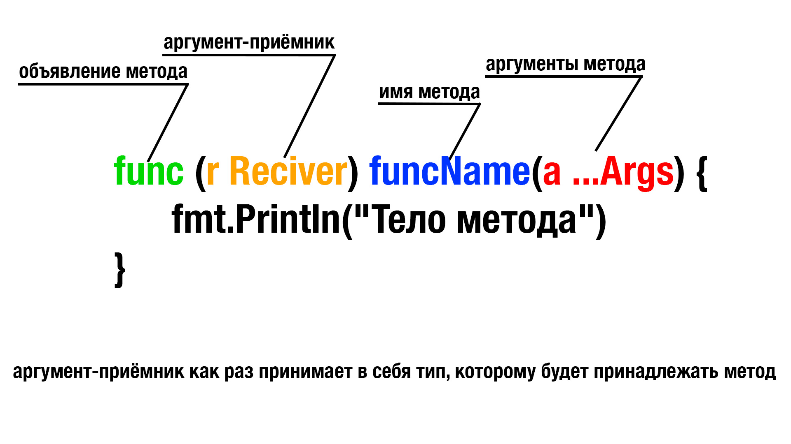

**В Go нет классического представления ООП**, но есть некоторый схожий функционал, например взамен классическому наследованию Go предлагает **композицию**, она может быть знакома людям пришедшим с JS, Python или (внезапно) Rust.

Также в Go есть **методы** и **интерфейсы**, но их реализация нестандартная, поэтому нужно познакомиться с ними поближе.

## Методы

В Go методы - это функции, которые имеют специальный получатель/приёмник (receiver), связанный с конкретным типом.

**Reciver** указывается перед именем функции, он позволяет вызывать метод для конкретного значения этого типа. Методы могут быть определены как для значений, так и для указателей на типы.

В Go можно объявлять методы для пользовательских типов данных, определенных в текущем пакете, в том числе и для структур.

Как это пишется?



На картинке выше можно увидеть, что аргументы метода странно описаны.

**Оператор упаковки** (многоточие) перед аргументом означает, что метод является **вариативной функцией,** то есть может в себя принимать произвольное количество аргументов. Из определения оператора упаковки можно понять, что эти аргументы куда-то запакуются. Очевидно, они образуют слайс целевого типа данных.

Есть ещё **оператор распаковки**, он пишется после имени переменной, например, когда мы хотим добавить в слайс элементы другого слайса. Мы не можем просто прибавить слайс через функцию **append()**, мы сначала его должны распаковать:

```
slc1 := []int{0, 1, 2, 3}

slc2 := []int{4, 5, 6, 7}

slc1 = append(slc1, slc2...)

fmt.Println(slc1) // [0 1 2 3 4 5 6 7]
```

### Примеры создания методов:

#### Пользовательский тип на основе встроенного типа int:

```
// Объявление типа
type MyInt int

// Объявление метода
func (i MyInt) Add(n MyInt) MyInt {
	return i + n
}

func main() {
	var num MyInt = 1

	fmt.Println(num.Add(1)) // 2
}
```

#### Структура:

```
// Структура
type Person struct {
	Name  string
	Age uint8
}

// Метод структуры Person
// Использование указателя для передачи структуры, чтобы можно было изменить значение поля Age
func (p *Person) growUp(y uint8) {
	p.Age += y
}

func main() {
	danya := Person{"Даня", 26}

	danya.growUp(1)

	fmt.Println(danya.Age) // 27
}
```

В примере со структурой видно, что структуру в метод мы передаём по указателю, чтобы иметь доступ к оригинальному экземпляру ~~класса~~ коллекции.

Представим, что мы не использовали бы указатель. В таком случае, вызов метода из созданного экземпляра структуры создаст копию этого экземпляра, и если метод реализует изменение поля этой структуры, то это изменение применится к копии.

Проверим это:

```Go
type Person struct {
	Name  string
	Age uint8
}

// Передаём структуру в метод по значению
func (p Person) growUp(y uint8) {
	p.Age += y
}

func main() {
	danya := Person{"Даня", 26}

	danya = danya.growUp(1)

	fmt.Println(danya.Age) // 27
}
```

Если бы мы не переопределили значение переменной `danya`, то на выводе у нас было бы число 26, а строчка с вызовом метода была бы подчёркнута как некорректная.

В общем, передача структуры по указателю позволяет управлять исходным экземпляром + снижает нагрузку на память, так как не передаётся полная копия всей структуры, а всего лишь адрес весом 8 байт в 64 битной системе или 4 байта в 32 битной.

## Конструктор (best practice)

Я перерыл весь интернет, и пока что, на момент написания этой главы (31.07.2024), это самая актуальная информация.

Общепринятой лучшей практикой в Go является использование указателя на структуру при создании экземпляра. Более того, принято реализовывать конструкторы для создания экземпляра структуры. Встроенного конструктора нет, нужно создавать для каждой структуры функцию, которая будет возвращать указатель на экземпляр структуры.

Преимущества:

-  Передача указателя позволяет избежать копирования всей структуры, что может быть дорогостоящим для больших структур

-  Возвращая указатель, мы можем изменять поля структуры после её создания

-  В Go интерфейсы часто работают с указателями на структуры, что позволяет реализовывать методы интерфейсов, изменяющие состояние объекта

Пример:

```Go
type Person struct {
	Name    string
	Age     uint8
	FavSong string
}

//Метод-конструктор, возвращающий экземпляр структуры. Принято обзывать "New + название структуры"
func NewPerson(name string, age uint8, favSong string) *Person {
	return &Person{
		Name:    name,
		Age:     age,
		FavSong: favSong,
	}
}

func main() {
	hughie := NewPerson("Hughie", 32, "Billy Joel - Pressure")
}
```

НО есть исключение, когда лучше всё-таки не использовать указатель на структуру, а передавать её по значению, об этом ниже.

## Композиция/встраивание (наследование)

Аналог наследованная из классического ООП.

**Композиция** - это возможность встроить однин структурный тип в другой с наследованием методов и полей.

Давайте на более ёмком примере разберём подходы к инициализации вложенных структур.

Создадим структуры Animal, Pet (наслледник Animal) и Cat (наследник Pet), заодно реализуем enum для поля Gender.

Рекомендую копировать примеры в IDE и пощупать, как это всё работает.

```
package main

import (
	"fmt"
)

type Gender int

const (
	Male Gender = iota + 1
	Female
)

func (s Gender) String() string {
	switch s {
	case Male:
		return "самец"
	case Female:
		return "самка"
	}
	return "ошибка"
}

type Animal struct {
	WeightKg float32
	SpeedKmH uint8
}

func (a *Animal) Say(sound string) string {
	fmt.Println(sound)
	return sound
}

type Pet struct {
	Animal Animal
	Name   string
	Age    float32
	Gender Gender
}

type Cat struct {
	Pet   Pet
	Breed string
}

func NewCat(name string, age float32, gender Gender, breed string, weghtKg float32, speedKmH uint8) *Cat {
	return &Cat{
		Pet: Pet{
			Animal: Animal{
				WeightKg: weghtKg,
				SpeedKmH: speedKmH,
			},
			Name:   name,
			Age:    age,
			Gender: gender,
		},
		Breed: breed,
	}
}

func main() {
	asya := NewCat("Ася", 0.5, Female, "бенгал", 2.5, 8)

	fmt.Println(asya) // &{{{2.5 8} Ася 0.5 самка} бенгал}

	asya.Pet.Animal.Say("Мяу") // Мяу
}
```

Прошу обратить внимание, как я расположил поля структур, в порядке убывания, вспоминаем про выравнивание. Можешь перепроверить размеры, используя пакет `unsafe` и функцию `Sizeof()`

:::note 

Хочу обратить внимание на то, что **при наследовании структуры,** **создаётся её экземпляр**.

А доступ к полям и методам этого экземпляра есть **напрямую из наследника**, поэтому передавать наследуемые структуры по указателю нет смысла.

:::

### Подытожим

В нашем примере мы создали **экземпляр структуры** `Cat` через функцию-конструктор, которая является **наследником структуры** `Pet`, которая в свою очередь является **наследником структуры** `Animal`. А так же реализовали метод `Say()` для структуры `Animal`

## Встраивание

Вовсе не обязательно использовать явное именование полей при композиции. Мы можем просто указать тип структуры, которую **встраиваем** в нашу структуру.

Эта форма композиции называется **встраивание**.

При **встраивании** поля и методы встроенной структуры становятся доступными напрямую, как если бы они были частью внешней структуры.

Пример:

```Go
package main

import (
	"fmt"
)

type Gender int

const (
	Male Gender = iota + 1
	Female
)

func (s Gender) String() string {
	switch s {
	case Male:
		return "Мужчина"
	case Female:
		return "Женщина"
	}
	return "ошибка"
}

type Human struct {
	Gender   Gender
	HeightM  float32
	WeightKg float32
	Age      uint8
}

func (h *Human) Say(s string) {
	fmt.Println(s)
}

type Person struct {
	Human
	Name     string
	FavCloth string
}

func NewPerson(name string, age uint8, gender Gender, heightM float32, weightKg float32, favCloth string) *Person {
	return &Person{
		Human: Human{
			Gender:   gender,
			HeightM:  heightM,
			WeightKg: weightKg,
			Age:      age,
		},
		Name:     name,
		FavCloth: favCloth,
	}
}

func main() {
	billy := NewPerson("Billy", 49, Male, 1.85, 87, "coat")

	// Получаем прямой доступ к методу, без вложенности 
	billy.Say(fmt.Sprintf("Oi! I love my focking %v!", billy.FavCloth))
}
```

### Передача структуры по значению или по указателю?

:::lab 

Выше уже описаны общепринятые практики, но всё же есть спорные моменты, хочу дать полную информацию, которую смог добыть.

Да и от проекта к проекту люди могут навязывать свои стандарты, поэтому важно знать, что и когда лучше всего использовать, чтобы навязать свои))))

:::

Когда мы передаём структуру по значению, мы создаём копию, что, разумеется, создаёт некоторые накладные расходы на память. Но важно понимать, **когда использовать указатели, а когда - оно того не стоит.**

Из раздела “База”, статьи про процессора, мы знаем, что кэш делится на кэш-линии, длиной по 64 байта.

И обычно принято ориентироваться на то, что если структура весит <= 64 байт, то нет смысла использовать указатели для передачи структуры, процесс копирования и так будет очень быстрым.

А лишний раз использовать указатели = захламлять кучу = напрягать garbage collector, который достаточно дорогой в Go.

:::note 

1. В Go сборщик мусора может стать узким местом в производительности, особенно при активном создании и удалении объектов в куче.

2. Избыточное использование указателей может увеличить нагрузку на сборщик мусора, что приведет к снижению производительности.

:::

А вот если структура > 64 байт…

Да в целом это холивар, здесь все по-своему на это смотрят: <https://habr.com/ru/companies/it-guide/articles/744046/>

Но вот немного слов ЗА и ПРОТИВ:

-  Если метод **не должен изменять структуру** (например, он только читает данные), можно передавать структуру **по значению**. Это помогает защитить данные от нежелательных изменений.

-  Передача структур по значению в метод или переменную может упростить код, избегая проверок на nil.

:::note 

**Каждый раз, когда ты работаешь с указателем, тебе нужно проверять, не равен ли он nil**. Пропуск такой проверки может привести к панике (runtime panic) при попытке доступа к полям структуры через nil-указатель.

:::

#### **Можно ориентироваться на следующее**:

-  Для структур размером до 2-3 кэш-линий (т.е. до 128-192 байт) передача по значению обычно приемлема.

-  Для структур размером больше 3 кэш-линий (более 192 байт) предпочтительнее передавать по указателю.

#### Примерные размеры

-  **Маленькие структуры** (до 64 байт): могут включать несколько примитивных полей, таких как `int`, `float64`, `bool`, и могут быть переданы по значению без значительных накладных расходов.

-  **Средние структуры** (64-192 байт): структуры, включающие несколько массивов или строк, и могут быть переданы по значению в зависимости от контекста и использования.

-  **Большие структуры** (более 192 байт): структуры, содержащие большие массивы, срезы или множество полей, чаще передаются по указателю для улучшения производительности.

#### **Консистентность**

Важно придерживаться единого стиля на протяжении всего проекта. Если принято во всём проекте передавать структуру по указателю, то необходимо придерживаться этого решения, учитывая все накладные расходы при разработке (например, проверки на nil).

## Интерфейсы

Частично основано на статье: <https://habr.com/ru/companies/vk/articles/463063/>

Ибо зачем что-то изобретать, когда уже какой-то умный человек всё написал за меня, я же только немного переформулирую, как бы это рассказывал я.

Интерфейсы в Go реализуют концепцию **полиморфизма** из ООП (это когда 2 разные сущности могут выполнять одни и те же действия).

Интерфейс - это тип, который характеризуется не значениеми, как все остальные типы, а **методами.** 

Интерфейс описывает внутри себя методы, которы должен **реализовать** в себе тип, который принадлежит этому интерфейсу.

:::note 

Мы говорим, что что-то **удовлетворяет **этому интерфейсу (или **реализует **этот интерфейс), если у этого чего-то есть метод с конкретной сигнатурой, которую описывает интерфейс.

:::

### Примеры

То есть, допустим у нас есть интерфейс `talker`, который должен **реализовать** метод `say()`, но при описании метода в интерфейсе **не нужно забывать точно указывать сигнатуру метода.**

Ещё у нас есть структура `human`, которая реализует метод `say()`, а ещё структура `parrot`, которая тоже реализует метод `say()`, а заодно функция `showSpeech()`, которая принимает в себя переменную типа `talker`, и выводит “речь” на экран.

```Go
package main

import (
	"fmt"
)

type talker interface {
	say(string) string
}

type human struct {
	name string
}

func newHuman(n string) *human {
	return &human{
		name: n,
	}
}

func (h human) say(s string) string {
	return fmt.Sprintf("Привет, меня зовут %v, хотел сказать: %v", h.name, s)
}

type parrot struct{}

func (p parrot) say(s string) string {
	return fmt.Sprintf("Чик-чирик, %v!", s)
}

func showSpeech(t talker, s string) {
	fmt.Println(t.say(s))
}

func main() {
	jhon := newHuman("Jhon")
	parrot := parrot{}

	showSpeech(jhon, "интерфейсы не сложные")
	showSpeech(parrot, "интерфейсы не сложные")
}
```

Из примера видно, что функция `showSpeech()` смогла принять в себя 2 разных типа, потому что они **удовлетворяют** интерфейсу `talker`. То есть функция `showSpeech()` является **гибкой**. Вот он, полиморфизм!

Но если бы мы передавали в функцию `showSpeech()` тип, который не реализует метод `say()`, то мы бы получили ошибку, например:

```Go
//…остальной код

type rat struct{}

func main() {
	remy := &rat{}
	showSpeech(remy, "Я не говорящий крыс!")
}
```

Подсветится в IDE:

```
cannot use remy (variable of type *rat) as talker value in argument to showSpeech: 
*rat does not implement talker (missing method say)
```

### Чем полезны интерфейсы?

-  **Уменьшение дублирования кода.** Интерфейсы позволяют описать общее поведение различных типов, что снижает необходимость написания шаблонного кода.

-  **Облегчение модульных тестов.** Интерфейсы позволяют легко заменять реальные объекты заглушками или мока-объектами при тестировании. Это полезно для тестирования компонентов в изоляции от внешних зависимостей, таких как базы данных или сетевые соединения.

-  **Модульность кода.** Интерфейсы помогают отвязывать части кодовой базы, что облегчает рефакторинг и изменение кода. Это способствует созданию более модульного и гибкого дизайна приложения.

Всё это вместе помогает писать более простой и чистый код в меньшее количество символов, а как мы знаем, **чем меньше кода, тем меньше багов!**

### Чтооо? Тип Any в Go???

В Go можно использовать пустой интерфейс, например `interface{}`, в таком случае, если что-то принимает в себя аргумент типа `interface{}`, то в это что-то можно впихнуть переменную любого типа.

Например:

```Go
package main

import "fmt"

func main() {
    person := make(map[string]interface{}, 0)

    person["name"] = "Alice"
    person["age"] = 21
    person["height"] = 167.64

    fmt.Printf("%+v", person)
}
```

Ну или вовсе мы могли бы объявить пустой интерфейс с именем `any` и тогда бы мы добавили бы капельку TypeScript в Go :)

Но есть нюанс в таком читерстве, помимо того, что это не безопасно с точки зрения ошибок, все значения теряют свой базовый тип. 

Например, если мы захотим прибавить к `person.age` единичку, то получим ошибку

```
invalid operation: person["age"] + 1 (mismatched types interface {} and int)
```

Поэтому при таком подходе надо сначала приводить значение обратно к своему базовому типу, а затем над ним производить операции:

```Go
package main

import "log"

func main() {
    person := make(map[string]interface{}, 0)

    person["name"] = "Alice"
    person["age"] = 21
    person["height"] = 167.64

    age, ok := person["age"].(int)
    if !ok {
        log.Fatal("could not assert value to int")
        return
    }

    person["age"] = age + 1

    log.Printf("%+v", person)
}
```

Согласен, не очень удобно, поэтому часто с этой штукой не играйся, тут тебе не динамическая типизация!

## **Полезные интерфейсные типы**

Вот короткий список самых востребованных и полезных интерфейсных типов из стандартной библиотеки. Если вы с ними ещё не знакомы, то рекомендую почитать соответствующую документацию:

-  [builtin.Error](https://golang.org/pkg/builtin/#error)

-  [fmt.Stringer](https://golang.org/pkg/fmt/#Stringer)

-  [io.Reader](https://golang.org/pkg/io/#Reader)

-  [io.Writer](https://golang.org/pkg/io/#Writer)

-  [io.ReadWriteCloser](https://golang.org/pkg/io/#ReadWriteCloser)

-  [http.ResponseWriter](https://golang.org/pkg/net/http/#ResponseWriter)

-  [http.Handler](https://golang.org/pkg/net/http/#Handler)